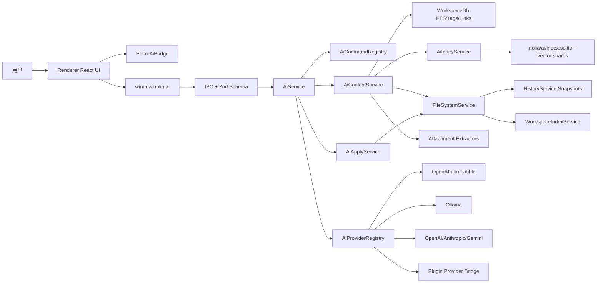
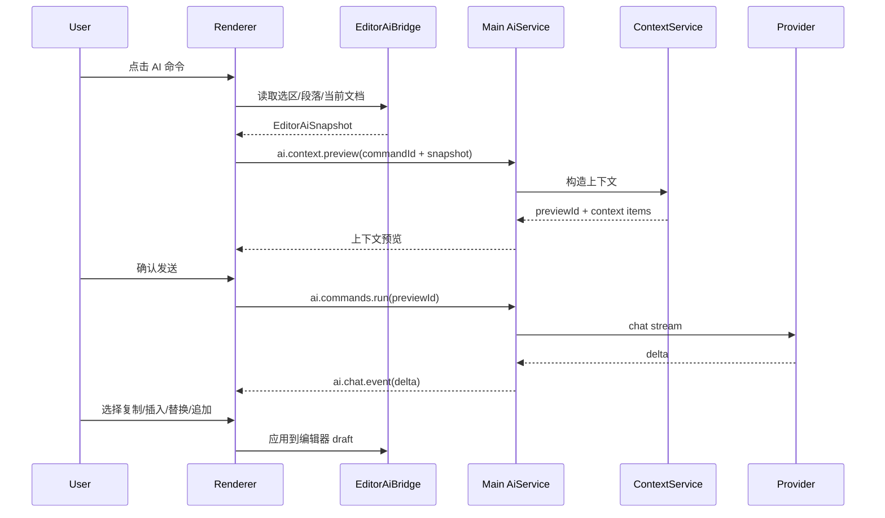
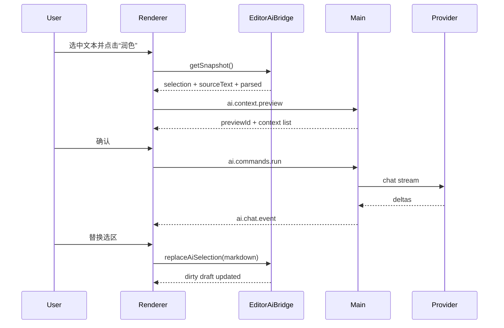
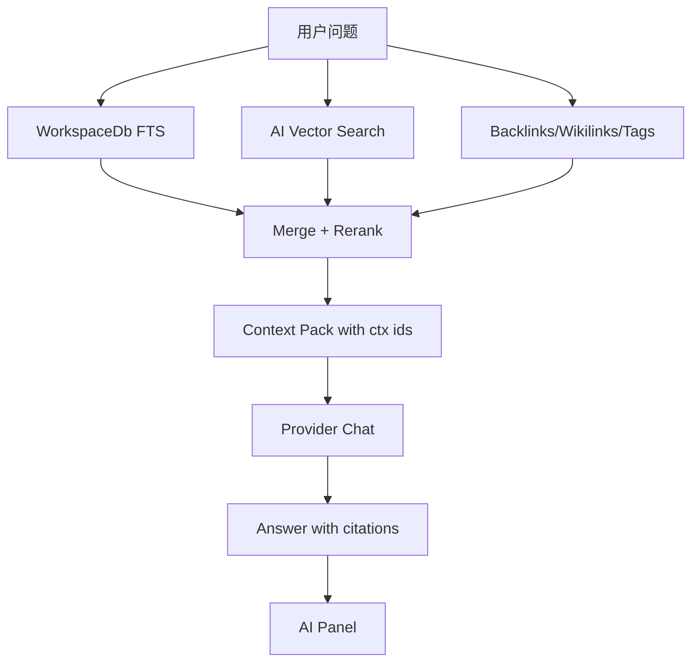
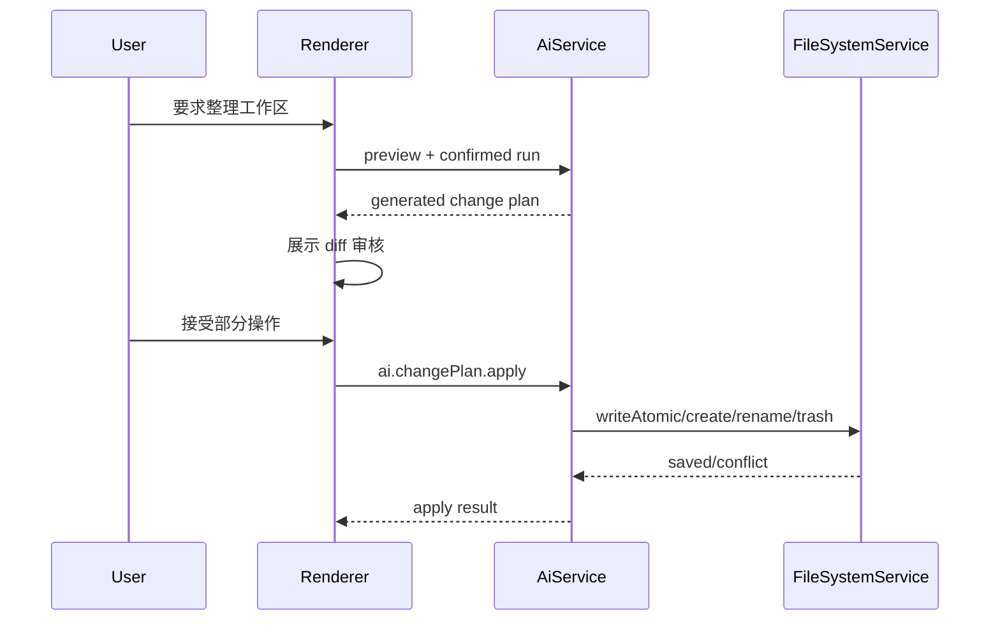

# Nolia AI 技术方案

状态：草案  
日期：2026-06-09  
关联需求：[Nolia AI 化需求文档](AI_PRODUCT_REQUIREMENTS.md)

## 1. 结论

Nolia AI 采用“自研轻量 AI 编排层 + Provider 适配器 + 本地可重建 AI 索引”的方案。

核心判断：

1. 不把 LangChain、LlamaIndex 或其他重型 AI 框架作为主架构。
2. 模型调用、上下文构造、RAG、命令、写入审核和插件扩展都由 Nolia 自己掌控。
3. Provider 层保持开放，内置 OpenAI-compatible、Ollama、OpenAI、Anthropic、Gemini，并允许插件注册 provider。
4. AI 索引作为 `.nolia/ai/` 下的可删除派生数据，不放入用户 Markdown 源文件。
5. AI 永远不直接绕过现有 `file.writeAtomic`、`baseHash` 冲突检测和历史快照链路。
6. Renderer 负责用户交互、当前未保存编辑器状态和结果应用；Main process 负责 provider 调用、密钥、工作区读取、索引和权限边界。

这不是一个独立聊天功能，而是一套嵌入 Nolia 编辑器、工作区索引、插件系统和文件安全链路的 AI 基础能力。

## 2. 当前代码事实

### 2.1 运行时分层

现有项目分层清晰：

- `src/main/`：Electron main process，负责 IPC、文件系统、工作区、索引、插件、导出、诊断日志。
- `src/preload/`：只暴露 `window.nolia`，renderer 不直接接触 Node/Electron。
- `src/renderer/`：React UI、编辑器、命令面板、插件渲染。
- `src/shared/`：IPC channel、Zod schema、共享类型、Markdown 解析、扩展贡献点。

AI 能力必须继续遵守这个边界：所有跨进程能力先定义 shared schema，再经 preload 暴露，再由 main handler 验证和执行。

### 2.2 文件写入链路

`src/main/services/fileSystemService.ts` 已具备：

- `writeAtomic` / `writeBinaryAtomic`
- `baseHash` 冲突检测
- 临时文件原子 rename
- `createSnapshot`
- 写入后触发 `WorkspaceIndexService.indexPathRel`

因此 AI 写入不应新增直写文件路径的通道。所有 AI 写入必须复用现有链路，或在其上封装批量审核计划。

### 2.3 工作区索引链路

`WorkspaceDb` 已有：

- `files`
- `documents`
- `tags`
- `document_tags`
- `wikilinks`
- `markdown_links`
- `attachment_refs`
- `snapshots`
- `recent_files`
- `document_fts` / `document_search`

`WorkspaceIndexService` 当前只对 Markdown 做结构化解析；非 Markdown 资源只进入文件索引。

AI RAG 可以复用已有文件、全文检索、标签、反链和附件引用，但需要新增独立的 AI chunk/embedding 索引。

### 2.4 编辑器链路

当前有两套编辑形态：

- `SourceEditor`：CodeMirror，能通过 ref 访问 selection 和 dispatch。
- `WysiwygEditor`：Tiptap/ProseMirror，目前 ref 只暴露 undo、redo、scrollToHeading。

AI 需要读取选区、当前段落、替换选区、插入到光标。不能让 AI UI 分别理解 CodeMirror 和 ProseMirror 内部细节，应新增统一的 `EditorAiBridge`。

### 2.5 插件系统

现有插件系统已经支持：

- manifest 贡献点
- 命令、菜单、侧边栏、文件编辑器、资源查看器、设置项
- 权限：workspace、clipboard、network、ui
- `aiProviders` 贡献点类型已存在，但当前只是 manifest 数据，没有运行时 provider 接入。

AI 插件扩展应延续现有权限体系，不引入无权限的模型调用或工作区读取。

### 2.6 诊断日志

`DiagnosticsService` 会把 `meta` 直接 JSON 序列化到 `nolia.log`。AI 相关日志必须走白名单字段，不能把 prompt、文档正文、模型回答、chunk 内容、API Key 放进日志。

## 3. 方案比选

### 3.1 方案 A：直接接入 LangChain / LlamaIndex

优点：

- 内置 provider、chain、retriever、tool abstraction。
- Demo 速度快。

问题：

- 抽象中心是“模型应用编排”，不是 Nolia 的“本地文件、安全写入、可见上下文、Markdown 差异审核”。
- 会把上下文构造、检索和工具调用隐藏到框架层，不利于向用户展示“发送了什么内容”。
- 依赖体积和跨端打包风险更高，Electron 主进程、renderer、插件边界都要额外适配。
- Agent 写入控制难做，容易绕过现有 `baseHash` 和快照链路。

结论：不作为主架构。

### 3.2 方案 B：只做一个 Chat 面板

优点：

- 最容易开发。
- 风险边界小。

问题：

- 不能发挥 Nolia 的编辑器、反链、全文索引、插件和本地文件优势。
- 用户仍要手动复制粘贴，无法形成真正的编辑器 AI。
- 工作区问答、引用、批量整理、审核式 Agent 都会变成后补能力。

结论：不符合最终产品定义。

### 3.3 方案 C：自研轻量 AI 层

组成：

- `AiService`：请求编排、流式任务、取消、错误映射。
- `AiProviderRegistry`：provider 适配和插件 provider 桥接。
- `AiContextService`：上下文预览、裁剪、引用 ID。
- `AiCommandRegistry`：预置命令、用户命令、工作区命令、插件命令。
- `AiIndexService`：chunk、embedding、混合检索。
- `AiApplyService`：单文档应用、多文件变更计划、diff、冲突检测。
- `CredentialService`：密钥加密保存。

优点：

- 完全贴合 Nolia 的本地优先、Markdown、IPC、插件和文件写入模型。
- 上下文可视化和写入确认可做成一等能力。
- Provider 可替换，不锁定单一厂商。
- 对测试友好，可以提供 mock provider 和 mock embedding。
- 不引入 native vector DB，降低 Electron 打包风险。

结论：采用。

## 4. 总体架构



关键原则：

- Renderer 不持有 API Key。
- Main process 不直接修改当前打开文档的未保存 draft。
- Main process 可读取工作区文件，但必须经过用户隐私设置和上下文预览。
- AI 写入必须形成用户可见动作。
- AI 索引可删除、可重建、可停用。

## 5. 新增模块

### 5.1 Shared

```text
src/shared/ai.ts
src/shared/aiCommands.ts
src/shared/aiSchemas.ts
```

职责：

- AI 类型定义。
- Zod schema。
- 内置 AI 命令定义。
- Provider、context、command、change plan、stream event 的跨进程契约。

也可以将 schema 保持在 `src/shared/ipc.ts`，但建议把 AI schema 放到 `aiSchemas.ts`，再由 `ipc.ts` re-export，避免 `ipc.ts` 继续膨胀。

### 5.2 Main process

```text
src/main/services/ai/aiService.ts
src/main/services/ai/aiProviderRegistry.ts
src/main/services/ai/providers/openAiCompatibleProvider.ts
src/main/services/ai/providers/ollamaProvider.ts
src/main/services/ai/providers/anthropicProvider.ts
src/main/services/ai/providers/geminiProvider.ts
src/main/services/ai/providers/mockProvider.ts
src/main/services/ai/aiContextService.ts
src/main/services/ai/aiCommandService.ts
src/main/services/ai/aiIndexService.ts
src/main/services/ai/aiVectorStore.ts
src/main/services/ai/aiApplyService.ts
src/main/services/ai/credentialService.ts
src/main/services/ai/attachmentExtractionService.ts
```

### 5.3 Renderer

```text
src/renderer/features/ai/AiAssistantPanel.tsx
src/renderer/features/ai/AiCommandEditor.tsx
src/renderer/features/ai/AiContextPreview.tsx
src/renderer/features/ai/AiResultActions.tsx
src/renderer/features/ai/AiChangePlanReview.tsx
src/renderer/features/ai/aiStore.ts
src/renderer/features/ai/editorAiBridge.ts
src/renderer/features/ai/useAiChat.ts
```

### 5.4 Existing files to modify

```text
src/shared/channels.ts
src/shared/ipc.ts
src/shared/types.ts
src/shared/constants.ts
src/shared/extensions.ts
src/shared/builtinExtensions.ts
src/preload/index.ts
src/main/ipc.ts
src/main/index.ts
src/main/services/workspaceService.ts
src/main/services/workspaceWatcher.ts
src/main/services/workspaceDb.ts
src/renderer/App.tsx
src/renderer/app/store.ts
src/renderer/components/SourceEditor.tsx
src/renderer/components/WysiwygEditor.tsx
src/renderer/styles/global.css
tests/e2e/helpers/mockNolia.ts
```

## 6. App Settings 与密钥

### 6.1 AppSettings 扩展

`src/shared/types.ts` 新增：

```ts
export interface AiSettings {
  enabled: boolean;
  defaultProviderId?: string;
  defaultModel?: string;
  providers: Record<string, AiProviderConfig>;
  privacy: {
    allowCurrentDocumentContext: boolean;
    allowWorkspaceContext: boolean;
    allowAttachmentContext: boolean;
    allowNetworkSearch: boolean;
    saveLocalConversationHistory: boolean;
    rememberContextApproval: boolean;
  };
  index: {
    enabled: boolean;
    embeddingProviderId?: string;
    embeddingModel?: string;
    includeTextResources: boolean;
    includeAttachments: boolean;
  };
}

export interface AiProviderConfig {
  id: string;
  type: "openai-compatible" | "ollama" | "openai" | "anthropic" | "gemini" | "plugin";
  label: string;
  baseUrl?: string;
  apiKeyRef?: string;
  defaultModel?: string;
  enabled: boolean;
}
```

`AppSettings` 增加：

```ts
ai: AiSettings;
```

`DEFAULT_SETTINGS` 增加默认值：

```ts
ai: {
  enabled: false,
  providers: {},
  privacy: {
    allowCurrentDocumentContext: true,
    allowWorkspaceContext: false,
    allowAttachmentContext: false,
    allowNetworkSearch: false,
    saveLocalConversationHistory: false,
    rememberContextApproval: false
  },
  index: {
    enabled: false,
    includeTextResources: true,
    includeAttachments: false
  }
}
```

### 6.2 CredentialService

不要把 API Key 放入 `global-state.json`。新增：

```text
{userData}/credentials.json
```

结构：

```ts
interface EncryptedCredentialFile {
  version: 1;
  credentials: Record<string, {
    label: string;
    encryptedValueBase64: string;
    createdAt: number;
    updatedAt: number;
  }>;
}
```

实现策略：

- 使用 Electron `safeStorage.encryptString` / `decryptString`。
- `safeStorage.isEncryptionAvailable()` 为 false 时，只允许会话保存，或显示明确风险确认后保存弱加密占位。
- `apiKeyRef` 只保存形如 `cred_openai_xxx` 的引用。
- `CredentialService` 不向 renderer 返回明文 key，只提供 set/delete/test 所需通道。
- Provider 调用发生在 main process，明文 key 只在 main 内存短暂存在。

## 7. IPC 与 Preload 设计

### 7.1 Channel

`src/shared/channels.ts` 新增：

```ts
aiSettingsGet: "ai.settings.get",
aiSettingsSet: "ai.settings.set",
aiCredentialSet: "ai.credential.set",
aiCredentialDelete: "ai.credential.delete",
aiProviderTest: "ai.provider.test",
aiModelsList: "ai.models.list",
aiContextPreview: "ai.context.preview",
aiChatStart: "ai.chat.start",
aiChatCancel: "ai.chat.cancel",
aiCommandsList: "ai.commands.list",
aiCommandsCreate: "ai.commands.create",
aiCommandsUpdate: "ai.commands.update",
aiCommandsDelete: "ai.commands.delete",
aiCommandsReorder: "ai.commands.reorder",
aiCommandsRun: "ai.commands.run",
aiIndexStatus: "ai.index.status",
aiIndexRebuild: "ai.index.rebuild",
aiChangePlanApply: "ai.changePlan.apply"
```

Renderer event channel：

```ts
"ai.chat.event"
"ai.index.event"
"ai.pluginProvider.request"
```

### 7.2 Preload API

`NoliaApi` 增加：

```ts
ai: {
  settings: {
    get: () => Promise<AiSettings>;
    set: (request: AiSettingsSetRequest) => Promise<AiSettings>;
  };
  credentials: {
    set: (request: AiCredentialSetRequest) => Promise<{ keyRef: string }>;
    delete: (request: AiCredentialDeleteRequest) => Promise<{ ok: boolean }>;
  };
  provider: {
    test: (request: AiProviderTestRequest) => Promise<AiProviderTestResponse>;
    listModels: (request: AiModelsListRequest) => Promise<AiModel[]>;
  };
  context: {
    preview: (request: AiContextPreviewRequest) => Promise<AiContextPreviewResponse>;
  };
  chat: {
    start: (request: AiChatStartRequest) => Promise<{ requestId: string }>;
    cancel: (request: { requestId: string }) => Promise<{ ok: boolean }>;
  };
  commands: {
    list: (request: AiCommandsListRequest) => Promise<AiCommandDefinition[]>;
    create: (request: AiCommandCreateRequest) => Promise<AiCommandDefinition>;
    update: (request: AiCommandUpdateRequest) => Promise<AiCommandDefinition>;
    delete: (request: AiCommandDeleteRequest) => Promise<{ ok: boolean }>;
    reorder: (request: AiCommandReorderRequest) => Promise<AiCommandDefinition[]>;
    run: (request: AiCommandRunRequest) => Promise<{ requestId: string }>;
  };
  index: {
    status: (request: AiIndexStatusRequest) => Promise<AiIndexStatus>;
    rebuild: (request: AiIndexRebuildRequest) => Promise<{ ok: boolean }>;
  };
  changePlan: {
    apply: (request: AiChangePlanApplyRequest) => Promise<AiChangePlanApplyResponse>;
  };
}
```

Events：

```ts
events: {
  onAiChatEvent: (listener: (event: AiChatStreamEvent) => void) => Unsubscribe;
  onAiIndexEvent: (listener: (event: AiIndexEvent) => void) => Unsubscribe;
}
```

### 7.3 流式响应

`ai.chat.start` 返回 `requestId`，随后由 main process 推送：

```ts
type AiChatStreamEvent =
  | { requestId: string; type: "started"; model: string; providerId: string }
  | { requestId: string; type: "delta"; text: string }
  | { requestId: string; type: "citation"; citation: AiCitation }
  | { requestId: string; type: "usage"; inputTokens?: number; outputTokens?: number; inputChars: number; outputChars: number }
  | { requestId: string; type: "result"; result: AiGeneratedResult }
  | { requestId: string; type: "error"; error: AiUserFacingError }
  | { requestId: string; type: "cancelled" }
  | { requestId: string; type: "done" };
```

`AiService` 内部维护：

```ts
Map<string, { abortController: AbortController; createdAt: number; workspaceId?: string }>
```

取消时：

- abort provider request。
- 停止继续向 renderer 发送 token。
- 发送 `cancelled`。
- 清理内存中的 context preview。

## 8. Provider 设计

### 8.1 接口

```ts
export interface AiProvider {
  id: string;
  type: AiProviderConfig["type"];
  label: string;
  listModels(config: ResolvedAiProviderConfig, signal?: AbortSignal): Promise<AiModel[]>;
  chat(request: AiProviderChatRequest, signal?: AbortSignal): AsyncIterable<AiProviderChatEvent>;
  embed?(request: AiEmbeddingRequest, signal?: AbortSignal): Promise<AiEmbeddingResponse>;
}
```

Provider event：

```ts
type AiProviderChatEvent =
  | { type: "delta"; text: string }
  | { type: "usage"; inputTokens?: number; outputTokens?: number }
  | { type: "done" };
```

### 8.2 内置 Provider

OpenAI-compatible：

- 使用 Node/Electron main process 的 `fetch`。
- `/v1/chat/completions`，`stream: true`。
- `/v1/embeddings`。
- SSE parser 自研，避免为一个协议引入大依赖。

Ollama：

- 默认 `http://127.0.0.1:11434`。
- `/api/tags` 列模型。
- `/api/chat` 流式生成。
- `/api/embed` 或兼容 embedding endpoint。

OpenAI、Anthropic、Gemini：

- 作为专用 provider adapter，映射各自消息格式、错误码、流式协议。
- UI 中提供预设 Base URL、模型列表和错误提示。
- 内部仍转成统一 `AiProviderChatEvent`。

Mock provider：

- 只用于单元测试、E2E 和开发。
- 支持固定回答、流式 delta、固定 embedding。
- 不访问网络。

### 8.3 为什么不用官方 SDK 作为核心依赖

官方 SDK 可以降低单个 provider 的接入成本，但 Nolia 需要同时支持 OpenAI-compatible、本地 Ollama 和插件 provider。核心层使用直接 HTTP adapter 更可控：

- 少一个主进程依赖和打包变量。
- 更容易统一超时、取消、日志脱敏和错误映射。
- 更容易支持用户自定义 Base URL。
- 避免 SDK 把请求细节隐藏起来，影响上下文透明展示。

如果某个 provider 的签名、流协议或文件上传协议复杂，可以在该 provider adapter 内部局部引入 SDK，但不能让 SDK 类型泄漏到 shared contract。

### 8.4 错误映射

所有 provider 错误映射为：

```ts
interface AiUserFacingError {
  code:
    | "not_configured"
    | "invalid_api_key"
    | "model_not_found"
    | "rate_limited"
    | "quota_exceeded"
    | "network_error"
    | "timeout"
    | "cancelled"
    | "provider_error"
    | "context_too_large"
    | "unsafe_payload";
  message: string;
  retryable: boolean;
  providerId?: string;
  statusCode?: number;
}
```

日志只记录 `code`、`providerId`、`statusCode`、耗时和字符数，不记录正文。

## 9. AI 命令系统

### 9.1 命令来源

统一注册：

- `builtin`：预置命令，定义在 `src/shared/aiCommands.ts`。
- `user`：全局自定义命令，保存在 userData。
- `workspace`：工作区自定义命令，保存在 `.nolia/ai/commands.json`。
- `plugin`：插件注册命令。

命令通过 `AiCommandRegistry` 合并，排序规则：

1. enabled 优先。
2. `order` 升序。
3. workspace 覆盖同 ID user 命令。
4. user/workspace 不能覆盖 builtin ID，只能复制生成新 ID。
5. plugin 命令必须以 pluginId 为前缀。

### 9.2 数据结构

```ts
export interface AiCommandDefinition {
  id: string;
  source: "builtin" | "user" | "workspace" | "plugin";
  pluginId?: string;
  name: string;
  description?: string;
  enabled: boolean;
  order: number;
  scopes: AiCommandScope[];
  promptTemplate: string;
  variables: AiCommandVariable[];
  defaultContext: AiContextPolicy;
  defaultApplyMode: AiApplyMode;
  providerOverride?: {
    providerId?: string;
    model?: string;
  };
  ui: {
    commandPalette: boolean;
    editorToolbar: boolean;
    contextMenu: boolean;
    aiPanel: boolean;
  };
}
```

允许变量：

```text
{{selection}}
{{currentParagraph}}
{{document}}
{{frontmatter}}
{{headings}}
{{workspaceResults}}
{{backlinks}}
{{attachments}}
{{language}}
```

变量替换规则：

- 不支持任意 JS 表达式。
- 未授权的上下文变量替换为空，并在 preview 中提示。
- 模板最大长度默认 20 KB。
- 渲染后的 prompt 进入同一套上下文预览和字符预算。

### 9.3 命令运行流程



## 10. EditorAiBridge

### 10.1 目标

AI 面板和命令不直接操作 CodeMirror 或 Tiptap，而是调用统一接口：

```ts
export interface EditorAiBridge {
  getSnapshot(): Promise<EditorAiSnapshot | undefined>;
  applyText(action: AiSingleDocumentApplyAction): Promise<AiApplyLocalResult>;
  focus(): void;
}
```

### 10.2 Snapshot

```ts
export interface EditorAiSnapshot {
  workspaceId?: string;
  sourceKind: "workspace" | "external";
  pathRel: string;
  filePath?: string;
  title: string;
  mode: "source" | "wysiwyg" | "split";
  baseHash: string;
  sourceText: string;
  parsed: ParsedDocument;
  selection?: {
    text: string;
    from?: number;
    to?: number;
    format: "markdown" | "plain";
  };
  currentParagraph?: {
    text: string;
    from?: number;
    to?: number;
  };
  dirty: boolean;
  revision: number;
}
```

### 10.3 Source 模式

`SourceEditor` ref 增加：

```ts
export interface SourceEditorHandle {
  view?: EditorView;
  getAiSelection(): EditorAiSelection;
  replaceAiSelection(text: string): void;
  insertAiText(text: string): void;
}
```

实现上可继续用 CodeMirror `view.state.selection.main` 和 `view.dispatch`。

### 10.4 WYSIWYG 模式

`WysiwygEditorHandle` 增加：

```ts
getAiSelection(): EditorAiSelection;
replaceAiSelection(markdown: string): Promise<void>;
insertAiMarkdown(markdown: string): Promise<void>;
```

WYSIWYG 应复用现有 `insertMarkdownPlainText` / `insertMarkdownBlockAtSelection` 思路：

- AI 输出 Markdown。
- 渲染为 HTML。
- 通过 ProseMirror schema parse 成 slice。
- replace selection 或 insert selection。
- transaction 设置 `noliaUserEdit`，确保触发现有 dirty/onChange。

### 10.5 Split 模式

Split 模式以 SourceEditor 为应用目标，preview 只跟随现有渲染链路更新。

## 11. 上下文构造

### 11.1 Preview-first

所有可能发送正文的请求都先走：

```ts
ai.context.preview(request)
```

返回：

```ts
export interface AiContextPreviewResponse {
  previewId: string;
  expiresAt: number;
  providerId: string;
  model?: string;
  estimatedInputChars: number;
  estimatedInputTokens?: number;
  items: AiContextItemPreview[];
  warnings: AiContextWarning[];
}
```

`previewId` 对应的完整 context 只保存在 main process 内存，TTL 默认 2 分钟，不写磁盘。

### 11.2 Context Item

```ts
export interface AiContextItem {
  id: string;
  kind:
    | "selection"
    | "current-paragraph"
    | "current-document"
    | "workspace-search-result"
    | "semantic-chunk"
    | "backlink"
    | "attachment"
    | "web";
  pathRel?: string;
  title?: string;
  headingPath?: string[];
  startLine?: number;
  endLine?: number;
  content: string;
  sourceHash?: string;
  score?: number;
}
```

Preview 中展示：

- kind
- pathRel
- title
- line range
- 字符数
- 片段预览
- 是否会发送正文

### 11.3 构造规则

顺序：

1. 用户选区。
2. 当前段落。
3. 当前文档结构摘要：标题、frontmatter、headings、tags。
4. 当前文档全文，受隐私开关和字符预算限制。
5. 工作区 FTS 搜索结果。
6. 语义 chunk。
7. 反链和双链邻居。
8. 附件抽取文本。
9. 网络搜索结果。

字符预算：

- 默认输入预算按 provider/model 配置。
- 没有准确 token 信息时，使用字符估算，不把估算作为安全边界。
- 每类上下文有上限，避免单个大文档挤掉其他来源。
- 超限时保留标题、路径和摘要，正文截断，并在 preview 中提示。

引用规则：

- prompt 中给每个 item 分配稳定引用 ID，例如 `[ctx-1]`。
- 要求模型回答中引用 `[ctx-1]`。
- 输出后把引用 ID 映射回文件、标题和行号。
- 没有来源的回答在 UI 中标记“未找到明确依据”。

## 12. AI 索引与 RAG

### 12.1 为什么 AI 索引不直接放进 workspace.sqlite

当前 `WorkspaceDb` 使用 `sql.js`，打开数据库时会把 SQLite 文件加载进内存。Embedding 向量体积很大，如果直接放进 `.nolia/workspace.sqlite`：

- 工作区打开会无条件加载大量向量。
- 普通搜索、文件树和反链会被 AI 数据拖慢。
- 删除和重建 AI 索引会影响核心索引文件。

因此 AI 索引单独放在：

```text
.nolia/ai/
  manifest.json
  commands.json
  index.sqlite
  embeddings/
    {embeddingProfileHash}/
      vectors-0001.f32
      vectors-0002.f32
  cache/
```

核心 `workspace.sqlite` 继续负责普通工作区索引。AI 索引是可删除派生数据。

### 12.2 AI index schema

`index.sqlite`：

```sql
CREATE TABLE ai_index_meta (
  key TEXT PRIMARY KEY,
  value_json TEXT NOT NULL,
  updated_at INTEGER NOT NULL
);

CREATE TABLE ai_sources (
  id INTEGER PRIMARY KEY AUTOINCREMENT,
  path_rel TEXT NOT NULL,
  source_kind TEXT NOT NULL,
  file_sha256 TEXT,
  mtime_ms INTEGER,
  extraction_hash TEXT,
  extraction_status TEXT NOT NULL,
  extraction_error TEXT,
  updated_at INTEGER NOT NULL,
  UNIQUE(path_rel, source_kind)
);

CREATE TABLE ai_chunks (
  id TEXT PRIMARY KEY,
  source_id INTEGER NOT NULL,
  path_rel TEXT NOT NULL,
  content TEXT NOT NULL,
  title TEXT,
  heading_path_json TEXT,
  tags_json TEXT,
  start_line INTEGER,
  end_line INTEGER,
  char_count INTEGER NOT NULL,
  token_estimate INTEGER,
  content_hash TEXT NOT NULL,
  deleted INTEGER NOT NULL DEFAULT 0,
  updated_at INTEGER NOT NULL
);

CREATE TABLE ai_embeddings (
  chunk_id TEXT NOT NULL,
  profile_hash TEXT NOT NULL,
  provider_id TEXT NOT NULL,
  model TEXT NOT NULL,
  dimensions INTEGER NOT NULL,
  vector_file TEXT NOT NULL,
  byte_offset INTEGER NOT NULL,
  byte_length INTEGER NOT NULL,
  norm REAL NOT NULL,
  content_hash TEXT NOT NULL,
  created_at INTEGER NOT NULL,
  PRIMARY KEY(chunk_id, profile_hash)
);

CREATE INDEX idx_ai_chunks_path ON ai_chunks(path_rel);
CREATE INDEX idx_ai_chunks_deleted ON ai_chunks(deleted);
CREATE INDEX idx_ai_embeddings_profile ON ai_embeddings(profile_hash);
```

Vector 文件使用 little-endian float32，按行追加：

```text
dimensions * 4 bytes per vector
```

删除 chunk 时只标记 metadata，向量文件保留空洞；重建或压缩索引时生成新 shard。

### 12.3 Chunking

Markdown chunk 规则：

- 按 heading 分段，保留 heading path。
- 单 chunk 目标 800-1200 字符，最大 1800 字符。
- overlap 约 120 字符。
- 尽量不拆 fenced code block、table、task list。
- 每个 chunk 保存 `startLine`、`endLine`。
- frontmatter 作为 metadata，不直接和正文混在一起。

文本资源 chunk：

- TXT/JSON/YAML/XML/HTML/代码文件进行纯文本抽取。
- 大文件默认只索引前 N KB，并在 index status 中提示。

附件 chunk：

- PDF：文本层抽取。
- 图片：OCR 文本和图片描述。
- 音频：转写文本。
- 每个附件抽取结果都作为 `source_kind = attachment:*`。

### 12.4 Embedding

Embedding profile：

```ts
interface AiEmbeddingProfile {
  providerId: string;
  model: string;
  dimensions: number;
  normalize: boolean;
}
```

`profile_hash = sha256(providerId + model + dimensions + normalize)`。

同一工作区可以存在多个 embedding profile。切换 embedding 模型不会破坏旧索引，但查询只使用当前 profile。

### 12.5 检索算法

混合召回：

1. FTS：使用 `WorkspaceDb.search` 召回文档。
2. Semantic：从 `.nolia/ai` 召回 chunk。
3. Graph：当前文档反链、双链邻居、同标签文档。
4. Scope filter：当前文档、当前文件夹、整个工作区。
5. Rerank：合并得分。

建议得分：

```text
finalScore =
  0.45 * semanticScore +
  0.35 * lexicalScore +
  0.10 * graphScore +
  0.05 * tagScore +
  0.05 * recencyScore
```

当 AI 索引未启用或未完成时：

- 工作区问答退化为 FTS + graph。
- UI 明确显示“语义索引未启用/未完成”。

### 12.6 向量搜索实现

不引入 native vector DB。理由：

- Electron 多平台打包已经复杂。
- 当前项目没有 native 数据库依赖。
- `sql.js` 不能直接使用常见 native SQLite vector extension。

实现方式：

- 候选 rerank：先由 FTS/graph 得到 50-200 个 chunk，再读取对应向量计算 cosine。
- 纯语义搜索：按 vector shard 顺序扫描，分批读取，维护 topK heap。
- 扫描在 main process 中使用 async chunk yielding，避免长时间阻塞事件循环。
- 大工作区可把扫描放入独立 `AiVectorWorker`，但 worker 只读 `.f32` shard 和只读 metadata snapshot，不写核心 workspace DB。

该方案牺牲极大规模 ANN 性能，换取本地可靠、无 native 打包风险、索引可删除重建。对个人 Markdown 工作区，这是更优工程选择。

## 13. AI 写入与 Agent

### 13.1 单文档写入

AI 结果应用方式：

- copy
- insert
- replace selection
- append
- new document
- diff

当前打开文档：

- Renderer 通过 `EditorAiBridge.applyText` 更新编辑器 draft。
- 现有 dirty/autosave 链路负责保存。
- 替换前必须弹确认。

未打开文件：

- Main process 读取当前内容和 hash。
- `AiApplyService` 生成 diff preview。
- 用户确认后调用 `FileSystemService.writeAtomic`。

### 13.2 多文件 Change Plan

AI Agent 不直接调用写文件工具，而是生成：

```ts
export interface AiChangePlan {
  id: string;
  workspaceId: string;
  summary: string;
  createdAt: number;
  operations: AiChangeOperation[];
}

export type AiChangeOperation =
  | {
      id: string;
      type: "create";
      pathRel: string;
      content: string;
    }
  | {
      id: string;
      type: "modify";
      pathRel: string;
      baseHash: string;
      before: string;
      after: string;
      diff: string;
    }
  | {
      id: string;
      type: "rename";
      sourcePathRel: string;
      targetPathRel: string;
      baseHash: string;
    }
  | {
      id: string;
      type: "delete";
      pathRel: string;
      baseHash: string;
    };
```

流程：

1. AI 生成 JSON change plan。
2. Zod 校验。
3. Main process 重新读取涉及文件，补齐 baseHash 和 before。
4. Renderer 展示 diff 和操作列表。
5. 用户逐项接受、拒绝或编辑。
6. `ai.changePlan.apply` 执行被接受的操作。
7. 每个操作应用前再次比对 baseHash。
8. 冲突文件跳过并返回 conflict，不覆盖磁盘。

### 13.3 History reason

`HistoryService.createSnapshot` 的 reason 建议扩展：

```ts
"autosave" | "manual" | "conflict" | "restore" | "ai"
```

AI 批量变更必须使用 `reason = "ai"`。

## 14. 附件与多模态

### 14.1 Extractor 接口

```ts
export interface AiAttachmentExtractor {
  id: string;
  supports(file: { pathRel: string; mimeType?: string; size: number }): boolean;
  extract(request: AiAttachmentExtractRequest, signal?: AbortSignal): Promise<AiAttachmentExtraction>;
}
```

输出：

```ts
interface AiAttachmentExtraction {
  text?: string;
  description?: string;
  language?: string;
  pages?: Array<{ page: number; text: string }>;
  segments?: Array<{ startMs: number; endMs: number; text: string }>;
  warnings: string[];
}
```

### 14.2 内置 extractor

- Text extractor：TXT、CSV、JSON、YAML、XML、HTML、代码文件。
- PDF extractor：优先文本层抽取。
- Image extractor：OCR + 图片描述。
- Audio extractor：转写 + 摘要。

为控制安装体积，OCR、音频转写和高级图片描述都通过 extractor provider 实现：

- 本地 provider：本地 OCR/STT 服务或插件。
- 云 provider：用户明确允许附件上下文后，由模型 provider 处理。

UI 必须显示附件内容是否会发送到云端。

## 15. 联网搜索

当前版本不实现联网搜索，不新增 `webSearchService`，也不把网络结果放入 AI 上下文。保留兼容 API 的目标是让旧调用和未来扩展安全降级，而不是提供隐藏能力。

```ts
ai.webSearch(request) => { providerId: "disabled", results: [] }
```

上下文规则：

- `AiContextService.preview()` 收到 `includeWebSearch: true` 时只追加“当前版本不支持联网搜索。”警告。
- preview 不调用任何网络 provider。
- preview 不生成 `AiContextItem.kind = "web"`。
- 设置页和 AI 面板不展示联网搜索入口。

## 16. 插件 AI 扩展

### 16.1 Manifest 扩展

`ExtensionContributions` 增强：

```ts
aiProviders?: AiProviderContribution[];
aiCommands?: AiCommandContribution[];
aiExtractors?: AiExtractorContribution[];
```

插件 AI provider 必须声明：

- `capabilities: ["ai"]`
- `permissions: ["network:request"]` 或具体 host 权限
- 如果要读工作区，还要 `workspace:file:read`

### 16.2 Renderer-hosted provider bridge

当前插件运行在 renderer。为了不引入 main-side 插件执行器，插件 provider 采用桥接模式：

1. 插件在 renderer 注册 provider handler。
2. `AiProviderRegistry` 中出现 `plugin:{pluginId}:{providerId}`。
3. Main process 需要调用插件 provider 时，通过 `webContents.send("ai.pluginProvider.request")` 请求 renderer。
4. Renderer plugin host 调用插件 handler。
5. 插件通过受控 `network.request` 访问外部模型。
6. Renderer 将流式结果转发回 main，再由 main 转发为统一 `ai.chat.event`。

约束：

- 插件 provider 默认不启用。
- 用户必须在设置页选择并启用该 provider。
- 每次上下文 preview 都显示 provider 来源插件。
- 插件 provider 收到的是已经经过用户确认的上下文。
- 插件 provider 异常会被隔离，必要时禁用插件。

该设计复用现有 renderer 插件系统，同时保留未来引入 main-side sandbox plugin host 的空间。

## 17. UI 集成

### 17.1 入口

新增内置扩展 `ai.assistant`：

- command：`ai.panel.open`
- command：`ai.command.run.{builtinId}`
- menu：编辑菜单和视图菜单入口
- setting contributions：AI 设置入口

Right panel 增加：

```ts
type RightPanelView = "outline" | "details" | "errors" | "ai";
```

`AiAssistantPanel` 放在右侧面板。命令面板和工具栏只是入口，不承载完整会话 UI。

### 17.2 AI 面板结构

- 顶部：provider/model、模式 selector。
- 上下文条：选区、当前文档、工作区、附件、联网。
- 对话区：流式输出、引用、错误。
- 输入框：用户问题。
- 结果操作：复制、插入、替换、追加、新建、生成 diff。
- 命令快捷区：预置命令和用户常用命令。

### 17.3 AI 设置

设置页新增 `AI` tab，不建议继续塞进现有基础设置 tab。

包含：

- AI 开关。
- Provider 列表。
- 新增 provider。
- API Key 输入和删除。
- 测试连接。
- 默认模型。
- 隐私开关。
- 索引状态和重建。
- 命令管理入口。

### 17.4 自定义命令编辑器

支持：

- 新建。
- 编辑。
- 删除。
- 启用/禁用。
- 拖拽排序。
- 从预置命令复制。
- Prompt 模板变量插入。
- 测试运行。
- 选择展示入口。

## 18. 数据流

### 18.1 选区 AI



### 18.2 工作区问答



### 18.3 多文件整理



## 19. 安全与隐私

必须满足：

- AI 默认关闭。
- Provider 未配置时 AI 入口可见但不可发送。
- API Key 不进 `global-state.json`、日志、renderer state dump。
- Prompt、文档正文、chunk 内容、模型回答不进诊断日志。
- `.nolia/`、`.git`、`node_modules` 永远不进入 AI 上下文。
- 禁用工作区上下文时，不读取其他文件。
- 附件单独确认；联网搜索当前不支持，所有兼容调用必须返回不支持警告且不访问网络。
- 插件 provider 显示来源插件和权限。
- 所有云 provider 显示“内容会发送到第三方模型服务”。
- 本地 provider 显示本地服务地址。

日志白名单：

```ts
interface AiDiagnosticMeta {
  requestId: string;
  providerId: string;
  model?: string;
  workspaceId?: string;
  commandId?: string;
  status: "started" | "completed" | "failed" | "cancelled";
  errorCode?: AiUserFacingError["code"];
  inputChars?: number;
  outputChars?: number;
  durationMs?: number;
}
```

## 20. 性能与并发

### 20.1 Provider 请求

- 每个 request 一个 AbortController。
- 同一窗口默认最多 3 个并发 chat 请求。
- Embedding 队列并发由 provider 配置决定，默认 1-2。
- Provider timeout 默认 60 秒，流式请求只要持续收到 token 就续期。

### 20.2 索引

- 文件变化先更新普通 workspace index，再 enqueue AI index。
- AI index 低优先级后台执行。
- UI 可暂停、恢复、重建。
- 大文件跳过或截断并显示 warning。
- Embedding 失败按 chunk 记录，不阻塞其他 chunk。

### 20.3 Main process 响应性

- 向量 shard 扫描分批 yield。
- 单批计算目标小于 16ms。
- 长任务向 renderer 发送进度。
- 禁止在 renderer 执行 embedding 或大规模 vector scan。

## 21. 测试方案

### 21.1 Unit

新增测试：

- `tests/aiProviderStream.test.ts`
- `tests/aiCommandRegistry.test.ts`
- `tests/aiPromptTemplate.test.ts`
- `tests/aiContextService.test.ts`
- `tests/aiVectorStore.test.ts`
- `tests/aiChangePlan.test.ts`
- `tests/credentialService.test.ts`

覆盖：

- SSE/NDJSON 流解析。
- Provider 错误映射。
- API Key 不明文落盘。
- Prompt 模板变量替换。
- 隐私开关下的上下文选择。
- 禁用工作区上下文时不读取其他文件。
- chunk 生成和 line range。
- mock embedding 检索。
- change plan schema 校验。
- baseHash 冲突不覆盖。

### 21.2 E2E

扩展 `tests/e2e/helpers/mockNolia.ts`：

- 增加 `window.nolia.ai` mock。
- Mock provider 支持流式 delta。
- Mock context preview。
- Mock command registry。

新增 specs：

- `tests/e2e/ai-settings.spec.ts`
- `tests/e2e/ai-selection-command.spec.ts`
- `tests/e2e/ai-workspace-qa.spec.ts`
- `tests/e2e/ai-custom-command.spec.ts`
- `tests/e2e/ai-change-plan.spec.ts`

覆盖：

- 未配置 provider 时显示设置引导。
- 配置 mock provider 后运行选区总结。
- 上下文 preview 可见。
- 替换选区前确认。
- 自定义命令出现在命令面板。
- 工作区回答展示引用并可跳转。
- 多文件 change plan 进入审核，不直接写入。

### 21.3 安全测试

- 搜索日志确认不包含 API Key。
- 搜索日志确认不包含 prompt 正文。
- 禁用 workspace context 后 payload 不包含其他文件内容。
- `.nolia/` 不进入 context item。
- 插件无 `network:request` 时不能作为 provider 发起请求。

## 22. 实现依赖顺序

这是工程依赖顺序，不改变最终产品范围。

1. Shared types/schema/channel/preload。
2. `CredentialService`、AI settings、mock provider。
3. `AiService` 流式请求、取消和错误映射。
4. `EditorAiBridge`、AI 面板、选区命令闭环。
5. `AiCommandRegistry`、预置命令、自定义命令编辑器。
6. `AiContextService`、上下文 preview、FTS 工作区问答。
7. `.nolia/ai` chunk/embedding 索引、混合检索。
8. Change plan、diff 审核、批量应用。
9. 附件 extractor、插件 provider bridge；联网搜索作为后续预留能力，当前只保留安全降级 API。

## 23. 主要风险与应对

| 风险 | 影响 | 应对 |
| --- | --- | --- |
| WYSIWYG Markdown 替换不稳定 | AI 结果破坏复杂 Markdown 结构 | 通过 `EditorAiBridge` 复用现有 Markdown->HTML->ProseMirror 插入逻辑；复杂文件级修改走 diff |
| Embedding 数据过大 | 工作区打开慢、内存高 | AI 索引独立于 `workspace.sqlite`，向量 shard 文件按需读取 |
| Provider 差异过大 | 错误和流式协议不一致 | 每个 provider adapter 映射成统一事件和错误码 |
| API Key 泄漏 | 安全事故 | `CredentialService` + 日志白名单 + renderer 不接触明文 key |
| AI 自动写错文件 | 数据损坏 | 所有写入 preview/diff/确认，并复用 baseHash 冲突检测和快照 |
| 插件 provider 越权 | 文档被外发 | 插件权限、用户显式启用、上下文 preview 显示插件来源 |
| 大模型输出不可解析 change plan | Agent 无法应用 | Zod 校验、失败时要求模型重生成，仍失败则只展示文本不应用 |
| 旧版本或插件请求联网搜索 | 隐私预期不一致 | 当前统一返回 disabled/空结果，context preview 只展示不支持警告且不访问网络 |

## 24. 最终建议

最优方案不是“接一个 AI SDK”，而是在 Nolia 当前架构上新增一层可控 AI 能力：

- Main process 承载 provider、密钥、索引、上下文和文件安全。
- Renderer 承载编辑器状态、上下文确认、结果审核和用户操作。
- `.nolia/ai` 承载可重建 AI 派生数据。
- `AiCommandRegistry` 统一预置、自定义和插件命令。
- `EditorAiBridge` 统一 Source/WYSIWYG/Split 的 AI 编辑动作。
- `AiChangePlan` 让 Agent 只能提出可审核变更，不能直接写盘。

这条路径技术成本高于简单 Chat 面板，但能保护 Nolia 最重要的本地优先、Markdown 可控、文件安全和插件生态边界，也是长期最稳的 AI 化路线。
