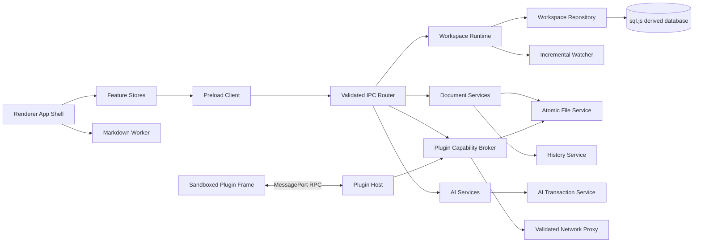
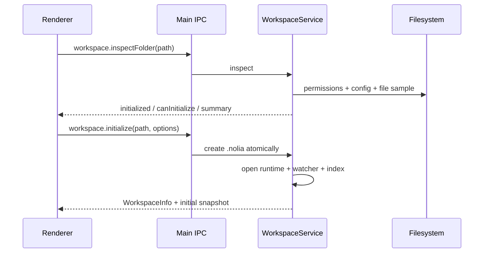
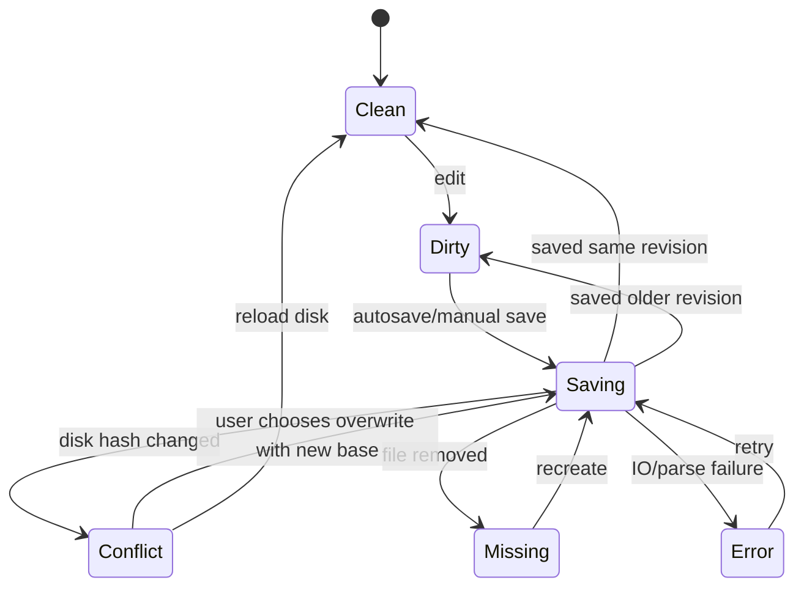

# Nolia 一次性升级技术设计

> 文档状态：实现基线与发布验收设计
>
> 关联产品方案：`docs/product/PRODUCT_UPGRADE_PLAN.md`
>
> 关联 UI/UX 规格：`docs/design/UI_UX_UPGRADE_SPEC.md`
>
> 交付方式：单一目标版本，一次性集成和发布
>
> 最近更新：2026-07-11

## 1. 目标与约束

### 1.0 当前实现状态（2026-07-11）

当前分支已实现 shared 契约、schema v4 迁移、工作区探测、只读缓存、序列化 watcher、虚拟文件树、多文档会话、草稿与 revision 状态、Markdown worker、主页/Inbox/Daily/模板、属性/标签事务、统一搜索/保存搜索/局部图、持久 AI 任务事务和 Plugin API v3 隔离。核心性能路径写入轮转 JSONL，本地不启用外部遥测。

renderer 已建立 `features/` 边界并通过 ESLint 禁止 feature 反向导入根 shell，但根 `App.tsx` 仍保留较多 orchestration 和旧组件定义。正式发布前仍需继续把 shell 内领域逻辑迁到 feature controller/store；不得把“已有 feature 文件”等同于架构拆分已完成。

### 1.1 技术目标

本次升级必须同时完成以下目标：

- 将 renderer 从集中式 `App.tsx` 拆为稳定 feature 边界。
- 建立可恢复、可测试的工作区和文档状态模型。
- 将文件树和索引从全量刷新改为增量事件驱动。
- 支撑属性、标签、模板、Daily Note、关系图和统一搜索。
- 将 AI proposal 扩展为可恢复的多文件事务。
- 将插件从 renderer 同上下文执行迁移到强隔离运行时。
- 建立历史配额、数据迁移、性能预算和统一错误模型。
- 保持 Markdown 正文兼容，不要求用户转换到专有格式。

### 1.2 硬约束

- Electron 继续使用 `nodeIntegration: false`、`contextIsolation: true`、`sandbox: true`。
- renderer 不直接访问 Node.js、文件系统、系统密钥或数据库。
- main process 是路径、权限、网络和持久化操作的最终信任边界。
- 所有 renderer -> main 请求都必须经过 shared schema 校验。
- 用户正文以工作区文件为事实来源；SQLite、索引、历史和会话属于派生或辅助数据。
- AI 和插件不能绕过原子写入、冲突检测和历史机制。
- 不在本次升级中引入实时协作、自建云同步或专有文档格式。

### 1.3 一次性交付含义

一次性交付指所有目标能力在同一个正式版本中上线，不提供缺少安全隔离、迁移或核心 UI 的中间正式版本。

工程内部允许：

- 并行 feature branch。
- 开发构建中的临时 feature flag。
- 契约原型和测试替身。
- 持续合入集成分支。

正式发布前必须删除或关闭所有用于隐藏未完成主流程的 feature flag。

## 2. 当前架构问题

### 2.1 Renderer

- `App.tsx` 同时拥有工作区、文档、资源、搜索、历史、AI、插件和布局状态。
- 相同信息同时存在 React state、Zustand、ref 和 localStorage，缺少统一所有权。
- `openDocs` 是内部多文档缓存，但没有完整的可见会话模型。
- 源码变化立即跨 IPC 完整解析 Markdown。
- 预览 effect 通过拼接所有打开文档的完整内容识别变化。
- UI 组件、领域操作和 IPC orchestration 混在同一文件。

### 2.2 Main process

- 文件树通过递归 `readdir + stat` 全量生成。
- watcher 只上报路径，renderer 收到后可能重新加载整棵树。
- `WorkspaceDb` 同时承担 schema、索引、搜索、语义、历史和持久化细节。
- `sql.js` 保存需要导出完整数据库，缺少 repository 边界和持久化指标。
- 历史快照没有自动清理。

### 2.3 Plugin runtime

- 插件模块由主 renderer 直接 `import()`。
- 插件可以访问宿主 DOM 和 `window.nolia`。
- renderer 侧 `fetch` 与 CSP、manifest 网络权限的职责冲突。
- 插件身份来自调用参数，而不是隔离通道绑定的不可伪造身份。

### 2.4 Quality

- watcher 测试存在 open handle 和 `EMFILE`。
- 缺少大工作区、长文档、历史增长和插件越权基准。
- 视觉测试覆盖多个主题，但目标版需要覆盖新信息架构和最小窗口。

## 3. 目标运行时架构



### 3.1 信任边界

| 区域 | 信任级别 | 允许能力 |
| --- | --- | --- |
| main process | 可信 | 文件系统、数据库、网络代理、系统 API |
| preload | 可信桥 | 固定 API、schema 对应调用、事件订阅 |
| renderer | 半可信 | UI、编辑状态、worker、受控 IPC |
| Markdown 内容 | 不可信数据 | 解析和净化后渲染，不执行脚本 |
| 外部插件 | 不可信代码 | 隔离 frame、MessagePort、能力授权 |
| AI 输出 | 不可信建议 | 展示、校验、proposal、人工批准 |

## 4. 目标代码结构

```text
src/
  main/
    app/
      bootstrap.ts
      lifecycle.ts
    ipc/
      registerHandlers.ts
      errorEnvelope.ts
    workspace/
      workspaceRuntime.ts
      workspaceRepository.ts
      workspaceMigration.ts
      fileTreeIndex.ts
      workspaceWatcher.ts
      workspaceHealthService.ts
    documents/
      fileService.ts
      historyService.ts
      propertyService.ts
      referenceUpdateService.ts
      templateService.ts
    search/
      searchService.ts
      hybridRanker.ts
      semanticIndexService.ts
    ai/
      runtime/
      tasks/
      transactions/
      tools/
    plugins/
      pluginCatalog.ts
      pluginBroker.ts
      pluginNetworkProxy.ts
      pluginSession.ts
  preload/
    index.ts
    clients/
  renderer/
    app/
      AppShell.tsx
      AppProviders.tsx
      ErrorBoundary.tsx
    features/
      workspace/
      documents/
      explorer/
      discovery/
      inspector/
      history/
      ai/
      plugins/
      settings/
    editors/
      markdown-wysiwyg/
      markdown-source/
      resource/
    workers/
      markdown.worker.ts
    components/
    styles/
      tokens.css
      shell.css
      editor.css
      discovery.css
      ai.css
      dialogs.css
  shared/
    ipc/
    domain/
    markdown/
    ai/
    plugins/
    i18n/
```

### 4.1 模块规则

- `renderer/features/*` 不得导入 `main/*`。
- feature 间不能读取对方内部 store；跨 feature 通过公开 selector、command 或 event。
- shared 只包含可序列化类型、schema 和无运行时权限的纯函数。
- main service 不返回 Electron 对象或 sql.js row。
- React 组件不直接拼装 IPC payload；由 feature client 或 command 负责。
- `AppShell` 不包含文件写入、AI 事件处理或插件权限逻辑。

## 5. 领域模型

### 5.1 WorkspaceSession

```ts
interface WorkspaceSession {
  workspace?: WorkspaceInfo;
  state: "closed" | "opening" | "ready" | "degraded" | "closing" | "error";
  treeVersion: number;
  indexVersion: number;
  health: WorkspaceHealth;
  lastError?: AppError;
}

interface WorkspaceHealth {
  writable: boolean;
  watcher: "ready" | "degraded" | "stopped";
  fullTextIndex: "ready" | "building" | "stale" | "error";
  semanticIndex: "disabled" | "ready" | "building" | "stale" | "error";
  historyBytes: number;
  historyQuotaBytes: number;
  warnings: WorkspaceWarning[];
}
```

工作区状态只能通过 command 改变。关闭工作区必须取消索引、停止 watcher、flush repository、清理 plugin session，然后才发送 `closed`。

### 5.2 DocumentSession

```ts
type DocumentId = string;

interface DocumentTab {
  id: DocumentId;
  source: "workspace" | "external";
  pathRel?: string;
  filePath?: string;
  title: string;
  mode: EditorMode;
  revision: number;
  diskHash: string;
  sourceText: string;
  wysiwygDraft?: string;
  parsed?: ParsedDocument;
  parseRevision?: number;
  saveState: "clean" | "dirty" | "saving" | "conflict" | "missing" | "error";
  lastSavedAt?: number;
  error?: AppError;
}

interface DocumentSession {
  tabs: DocumentTab[];
  activeId?: DocumentId;
  recentlyClosed: ClosedDocumentRef[];
}
```

约束：

- `revision` 在每次用户内容变化时递增。
- parse result 只有在 `parseRevision === revision` 时才能应用。
- 保存请求携带 `revision` 和 `diskHash`。
- 保存完成时，如果当前 revision 高于请求 revision，只更新 `diskHash`，保持 `dirty`。
- WYSIWYG HTML 只是当前 revision 的 draft，不是事实来源。
- 切换模式前必须完成可逆转换；转换失败时保持原模式和原内容。

### 5.3 TreeSnapshot

```ts
interface TreeSnapshot {
  workspaceId: string;
  version: number;
  roots: FileTreeNode[];
}

type TreePatchOperation =
  | { kind: "upsert"; node: FileTreeNode; parentPath: string }
  | { kind: "remove"; pathRel: string }
  | { kind: "move"; sourcePathRel: string; target: FileTreeNode; parentPath: string };

interface TreePatchEvent {
  workspaceId: string;
  baseVersion: number;
  nextVersion: number;
  operations: TreePatchOperation[];
}
```

renderer 只在版本连续时应用 patch。版本断裂时请求一次新 snapshot，不尝试猜测合并。

### 5.4 SearchQuery

```ts
interface UnifiedSearchQuery {
  text: string;
  scopes: Array<"title" | "body" | "path" | "tag" | "property" | "task">;
  filters?: {
    pathPrefix?: string;
    tags?: string[];
    properties?: Record<string, string | number | boolean>;
    modifiedAfter?: number;
    modifiedBefore?: number;
  };
  mode: "exact" | "hybrid";
  limit: number;
  cursor?: string;
}
```

### 5.5 AI Task 与事务

```ts
type AiTaskState =
  | "queued"
  | "running"
  | "awaiting_approval"
  | "applying"
  | "completed"
  | "failed"
  | "cancelled"
  | "rolled_back"
  | "rollback_failed";

interface AiWriteTransaction {
  id: string;
  taskId: string;
  workspaceId: string;
  state: "prepared" | "applying" | "committed" | "rolling_back" | "rolled_back" | "failed";
  operations: AiTransactionOperation[];
  createdAt: number;
  completedAt?: number;
}
```

事务和 task snapshot 必须持久化到 `.nolia`，应用重启后能够恢复状态。

## 6. Renderer 状态与命令

### 6.1 Store 划分

继续使用 Zustand，但限制用途：

- `workspaceStore`：工作区会话、tree snapshot、health。
- `documentStore`：tabs、activeId、revision、save state。
- `discoveryStore`：查询、筛选、结果、保存搜索。
- `aiStore`：conversation、task summary、approval、proposal UI。
- `uiStore`：主题、面板宽度、折叠、当前一级入口。

服务端事实数据通过 action 更新，不允许组件直接 `set` 任意领域字段。

### 6.2 Command API

```ts
interface AppCommands {
  workspace: {
    openFolder(path?: string): Promise<void>;
    close(): Promise<void>;
    refresh(): Promise<void>;
  };
  documents: {
    open(target: DocumentTarget): Promise<DocumentId>;
    close(id: DocumentId, options?: { force?: boolean }): Promise<void>;
    updateSource(id: DocumentId, source: string): void;
    save(id: DocumentId): Promise<void>;
    changeMode(id: DocumentId, mode: EditorMode): Promise<void>;
  };
  discovery: {
    search(query: UnifiedSearchQuery): Promise<void>;
  };
  ai: {
    start(request: AiTaskRequest): Promise<string>;
    approve(taskId: string, operationIds: string[]): Promise<void>;
    reject(taskId: string, reason?: string): Promise<void>;
    undo(transactionId: string): Promise<void>;
  };
}
```

组件只调用 command，不负责 watcher token、hash、IPC channel 或 proposal fallback。

### 6.3 事件订阅

所有订阅使用统一 disposable registry：

```ts
interface Disposable {
  dispose(): void;
}

class SubscriptionScope {
  add(disposable: Disposable): void;
  dispose(): void;
}
```

Workspace、AI 和 plugin session 关闭时必须销毁对应 scope。E2E test hook 也必须遵守相同生命周期。

## 7. IPC 设计

### 7.1 统一返回 envelope

```ts
type IpcResult<T> =
  | { ok: true; data: T }
  | { ok: false; error: AppError };

interface AppError {
  code: AppErrorCode;
  message: string;
  retryable: boolean;
  details?: Record<string, string | number | boolean>;
}
```

禁止把 raw stack、绝对敏感路径、Provider secret 或数据库错误直接发给 renderer。

建议错误码：

```text
workspace_not_open
workspace_not_initialized
workspace_read_only
path_outside_workspace
file_conflict
file_missing
file_permission_denied
parse_failed
index_stale
history_quota_exceeded
plugin_permission_denied
plugin_timeout
plugin_network_denied
ai_provider_failed
ai_approval_required
transaction_precondition_failed
transaction_rollback_failed
```

### 7.2 新增 channel 分组

```text
workspace.inspectFolder
workspace.initialize
workspace.health.get
workspace.tree.snapshot
workspace.tree.patch.event
workspace.session.restore
workspace.session.save

document.properties.read
document.properties.update
document.references.previewRename
document.references.applyRename
document.template.list
document.template.createFrom
document.daily.openOrCreate
document.inbox.capture

search.unified.query
search.saved.list
search.saved.upsert
search.saved.remove

graph.local.get

ai.task.event
ai.transaction.read
ai.transaction.undo

plugin.session.open
plugin.session.close
plugin.rpc.request
plugin.rpc.response
```

所有 channel 必须在 `src/shared/ipc/` 定义 schema，并由 main 的 router 统一注册。

### 7.3 事件 envelope

```ts
interface RuntimeEvent<TType extends string, TPayload> {
  id: string;
  type: TType;
  workspaceId?: string;
  sequence: number;
  emittedAt: number;
  payload: TPayload;
}
```

sequence 以 session 为单位单调递增。renderer 检测到丢序时重新获取对应 snapshot。

## 8. 工作区生命周期

### 8.1 打开普通目录



初始化要求：

- 只创建 `.nolia` 及内部文件。
- 使用临时 config 后 rename，避免半初始化。
- 如果 `.nolia` 已存在但不完整，进入修复流程，不覆盖未知数据。
- 只读目录允许以只读模式打开，但禁用写入、历史和 AI proposal 应用。

### 8.2 关闭顺序

1. renderer 请求保存所有 dirty document。
2. 有冲突时展示统一关闭确认，不自动覆盖。
3. 停止接受新 AI 和 plugin 写请求。
4. 取消或持久化 AI task。
5. 关闭 plugin session。
6. 停止 watcher 并等待 active task。
7. flush repository。
8. 清空 renderer session。

任一步失败都返回结构化错误；应用退出时使用最大超时和诊断日志，但不能无限等待。

## 9. 增量文件树与索引

### 9.1 Main 侧 FileTreeIndex

main 在内存中维护规范化节点 map：

```ts
Map<string, FileTreeEntry>
```

初次扫描采用有界并发，默认并发度 16，可根据平台调整。目录读取使用 `Dirent`，只在需要 size/mtime 时调用 `stat`。

### 9.2 Watcher 批处理

- 聚合窗口：100 ms。
- 相同路径多事件折叠为最终状态。
- unlink + add 且 inode/hash 匹配时识别为 move；无法确认时退化为 remove + upsert。
- 批次应用后只保存一次数据库并发送一个 patch event。
- watcher error 切换 health 为 degraded，并允许用户手动重建。

### 9.3 索引规则

- mtime、size 和已有 hash 均未变化时跳过正文读取。
- Markdown 解析失败不删除旧索引，标记文件 stale 并记录诊断。
- 全文索引和语义索引使用独立版本；全文更新不能等待 embedding。
- 语义任务可取消、可恢复，并限制并发和单文件大小。

## 10. Markdown 编辑管线

### 10.1 Worker 协议

```ts
type MarkdownWorkerRequest =
  | { type: "parse"; documentId: string; revision: number; pathRel: string; source: string }
  | { type: "render"; documentId: string; revision: number; source: string; options: RenderOptions }
  | { type: "htmlToMarkdown"; documentId: string; revision: number; html: string; originalSource: string };
```

- Source 模式解析 debounce 120 ms。
- Split 预览 render debounce 180 ms。
- WYSIWYG 输入在 editor 内即时更新，序列化在空闲窗口或保存前完成。
- Worker request 支持 AbortSignal 等价的 cancel message。
- 10 万字以上文档关闭实时 Mermaid，显示手动渲染入口。

### 10.2 保存状态机



冲突界面提供：比较磁盘版本、保留本地副本、重新加载磁盘、另存为。禁止只有“失败”提示而没有恢复路径。

## 11. 属性、模板和引用更新

### 11.1 YAML 属性写回

使用 `yaml` 的 `parseDocument` 和 CST/Document API 修改 frontmatter，不能先转普通对象再整体 stringify。

要求：

- 保留未知字段、注释和字段顺序。
- 只修改用户操作的 key。
- 不支持的 YAML 类型显示只读原始值。
- 写回前校验最终文档可以重新解析。
- 属性更新走 DocumentSession revision 和原子保存。

### 11.2 模板

模板位于可配置的 workspace 目录，默认 `.nolia/templates` 不合适，因为模板是用户内容；建议默认 `Templates/`，用户可修改。

允许变量白名单：

```text
{{title}}
{{date}}
{{time}}
{{datetime}}
{{workspace}}
{{inbox}}
```

不执行 JavaScript、shell、网络请求或任意表达式。

### 11.3 引用重命名事务

1. main 根据索引生成受影响引用列表。
2. 重新读取每个文件并验证 hash，避免使用陈旧索引直接修改。
3. renderer 展示逐文件 preview。
4. 用户确认后创建 transaction 和 before snapshot。
5. 逐文件原子写入。
6. 任一失败时回滚已写文件。
7. 重建相关索引并发送 tree patch。

## 12. 统一搜索与局部关系图

### 12.1 混合排序

精确结果来自 FTS、路径、标签、属性和任务索引；语义结果来自 embedding。使用 Reciprocal Rank Fusion 合并：

```text
score = sum(1 / (60 + rank_i)) + exactTitleBoost + recentBoost
```

规则：

- 标题精确匹配始终高于纯语义匹配。
- 路径和标签命中有明确类型标识。
- recent boost 只能打破相近分数，不能覆盖精确相关性。
- 语义索引不可用时返回 full-text 结果并声明降级原因。

### 12.2 分页

使用 opaque cursor，不使用随数据变化不稳定的纯 offset。cursor 至少包含 query hash、index version 和 last rank key。

### 12.3 局部图

- 默认深度 1，最多 60 个节点、120 条边。
- 边类型：wikilink、markdown link、unlinked mention。
- 节点按当前、直接链接、间接链接区分视觉层级。
- 图数据由 main 计算，renderer 只负责布局和交互。
- 节点点击打开文档，键盘可以遍历和退出图视图。

## 13. 历史策略

默认策略：

- 每个文档最多保留 50 个 autosave snapshot。
- 24 小时内最多每 10 分钟保留一个。
- 1 至 30 天最多每天保留一个。
- manual、conflict、restore snapshot 不参与普通数量淘汰。
- workspace soft quota 默认 1 GB，hard quota 默认 2 GB。
- 达到 soft quota 时清理最旧 autosave。
- 达到 hard quota 且无法继续清理时暂停新 autosave snapshot，但文件保存仍继续，并展示健康警告。

清理必须同时删除文件和数据库记录。启动时执行轻量一致性检查，完整修复由工作区健康页触发。

## 14. AI 事务设计

### 14.1 Proposal 预检查

每个 operation 必须包含：

- operation ID。
- path 或 source/target path。
- expected base hash。
- before/after preview。
- permission scope。
- 风险级别。

批准前重新验证：工作区、路径、文件 hash、目标不存在约束、只读状态和路径冲突。

### 14.2 部分接受

用户可以选择 operation 子集。main 根据依赖图检查选择是否闭合，例如“创建目录”是“在目录中创建文件”的依赖。缺少依赖时 UI 禁止批准并解释原因。

### 14.3 应用与回滚

- 写入前持久化 transaction 为 `prepared`。
- 保存所有 before image 或 snapshot ID。
- operation 串行应用，状态逐项持久化。
- 全部成功后标记 `committed`。
- 中途失败立即进入 `rolling_back`。
- 回滚失败保留 transaction 和明确文件列表，不能宣称已撤销。

### 14.4 Prompt injection 防护

- 笔记、搜索结果、插件结果都标记为不可信上下文。
- tool permission 由运行时决定，模型无法自行扩大 scope。
- tool 输出 schema 校验后才能进入下一轮。
- 文件写入工具只产生 proposal，不直接执行。
- 来源引用保存 path、hash、片段范围和检索方式。

## 15. 插件隔离设计

### 15.1 UI 插件容器

- 使用 `nolia-plugin://<plugin-id>/` 独立 origin。
- iframe 设置 `sandbox="allow-scripts"`，不包含 `allow-same-origin`、表单、弹窗和顶层导航权限。
- 插件 frame 不加载 Nolia preload，不存在 `window.nolia`。
- CSP 的 `frame-src` 加入 `nolia-plugin:`，插件自身 CSP 默认禁止网络。
- 宿主与 frame 只通过初始化时传入的 MessagePort 通信。

### 15.2 PluginSession

```ts
interface PluginSession {
  sessionId: string;
  pluginId: string;
  permissionHash: string;
  grantedCapabilities: PluginCapability[];
  expiresAt: number;
}
```

sessionId 由 main 生成并绑定 WebContents/frame identity。插件 payload 中的 pluginId 不作为鉴权依据。

### 15.3 RPC

```ts
interface PluginRpcRequest {
  id: string;
  method: string;
  params: unknown;
}

interface PluginRpcResponse {
  id: string;
  ok: boolean;
  result?: unknown;
  error?: { code: string; message: string };
}
```

- params 和 result 都按 method schema 校验。
- 默认超时 10 秒，长任务使用 task handle。
- 单插件并发请求默认上限 8。
- 响应正文和二进制读取设置大小上限。

### 15.4 网络代理

main 只允许 HTTPS；本地开发插件经显式设置可允许 loopback HTTP。

校验内容：

- manifest host allowlist。
- 用户当前接受的 permission hash。
- DNS/重定向后的最终 host。
- 禁止 `file:`、`javascript:`、`data:`、内网地址和 metadata endpoint。
- 请求体、响应体、超时和重定向次数上限。
- 不自动附带应用 cookie、Authorization 或系统代理凭证。

### 15.5 API v2 迁移

现有直接返回 HTMLElement 的 renderer 插件不能原样安全运行。目标版提供：

- API v3 sandbox SDK。
- v2 manifest 检测和禁用说明。
- 示例 JSON 编辑器迁移版本。
- 不提供在主 renderer 中继续执行 v2 代码的兼容开关。

安全边界优先于无感兼容。

## 16. 数据库与迁移

### 16.1 本次数据库决策

目标版本继续使用 `sql.js`，但所有调用迁入 `WorkspaceRepository`，并实施：

- 批次 transaction。
- debounce 持久化。
- 原子数据库文件替换。
- 导出耗时和文件大小指标。
- schema version 和 migration log。

本次不引入 native SQLite，避免在一次性大升级中同时增加三平台 native module 风险。

### 16.2 `.nolia` 目标结构

```text
.nolia/
  workspace.json
  workspace.db
  migrations/
    migration-log.json
  snapshots/
  ai/
    tasks/
    transactions/
  cache/
  logs/
```

### 16.3 MigrationRunner

```ts
interface WorkspaceMigration {
  id: string;
  fromVersion: number;
  toVersion: number;
  preflight(context: MigrationContext): Promise<MigrationCheck>;
  run(context: MigrationContext): Promise<void>;
  verify(context: MigrationContext): Promise<void>;
}
```

迁移流程：

1. 获取 workspace migration lock。
2. 检查磁盘空间和可写权限。
3. 备份 config 和 database。
4. 执行 migration。
5. 验证 schema 和关键查询。
6. 记录 migration log。
7. 失败时恢复备份；正文文件不参与自动迁移。

## 17. 错误处理与诊断

### 17.1 Renderer

- AppShell、编辑器、设置、插件 frame、AI task 分别设置 error boundary。
- 错误界面提供重试、打开日志、复制诊断 ID，不显示 stack。
- toast 只用于已完成的短反馈；需要决策或恢复的错误使用持久 panel/dialog。

### 17.2 Main

每条高风险操作生成 `operationId`，日志包含：

- operation type。
- workspaceId，必要时使用相对路径。
- duration。
- result code。
- retry count。
- 不包含正文、API key、完整 AI prompt 或敏感绝对路径。

### 17.3 本地指标

默认只保存在本地诊断数据库：

- startup duration。
- tree scan/patch duration。
- parse/render duration。
- DB export duration/size。
- search duration/result count。
- watcher queue depth。
- AI transaction apply/rollback duration。

对外遥测保持关闭，启用时必须单独获得用户同意。

## 18. 性能预算

| 指标 | 预算 | 测试数据 |
| --- | --- | --- |
| 冷启动可交互 | P95 < 2 s | 1000 文件工作区 |
| 初始树可浏览 | P95 < 2 s | 10000 文件、1000 目录 |
| watcher patch | P95 < 500 ms | 单文件变化 |
| 编辑输入阻塞 | P95 < 16 ms | 10 万字 Markdown |
| 分屏预览 | P95 < 250 ms | 2 万字、无 Mermaid |
| FTS 搜索 | P95 < 150 ms | 10000 Markdown 文件 |
| 局部图加载 | P95 < 300 ms | 60 节点、120 边 |
| DB flush | P95 < 500 ms | 目标上限数据库 |
| 插件 RPC | P95 < 50 ms | 不含文件和网络 IO |
| AI transaction apply | P95 < 2 s | 10 个小文件，不含模型时间 |

构建预算：

- 主 renderer 首屏 JS gzip 不超过 70 KB。
- 工作区主页不加载 TipTap、CodeMirror 或 Mermaid。
- WYSIWYG 首次打开加载 gzip 不超过当前基线。
- Mermaid 只在需要时加载，加载失败不阻塞普通 Markdown。

## 19. 测试设计

### 19.1 单元测试

- Document revision 和保存状态机。
- Tree patch 合并与版本断裂。
- YAML CST 属性更新。
- 模板变量和安全限制。
- 混合搜索排序。
- 历史保留与 quota。
- AI operation 依赖和 transaction rollback。
- Plugin capability、RPC schema 和 host allowlist。

### 19.2 集成测试

- 普通目录初始化与只读目录。
- watcher 批次到 repository 和 renderer patch。
- 外部编辑冲突与恢复。
- 文件重命名和引用事务。
- 数据库 migration 成功、失败和恢复。
- AI 多文件应用、部分接受、重启恢复和回滚失败。
- 插件越权、超时、崩溃和网络重定向。

### 19.3 E2E

必须覆盖完整用户流程：

1. 首次打开普通 Markdown 目录并初始化。
2. 从主页创建笔记、应用模板、编辑属性和标签。
3. 创建链接、重命名文件并审查引用变化。
4. 使用统一搜索和局部关系图找回内容。
5. 打开多个文档、恢复会话和处理磁盘冲突。
6. 运行 AI 工作区任务、部分批准、撤销并重启恢复。
7. 安装 API v3 示例插件、授权、拒绝越权并禁用。
8. 达到历史 soft quota 后自动清理。

### 19.4 安全测试

- path traversal、symlink escape 和编码绕过。
- renderer 构造非法 IPC payload。
- plugin frame 访问 parent、top、preload 和宿主 DOM。
- plugin 伪造 session/pluginId。
- network redirect 到未授权 host 或内网。
- Markdown raw HTML、URL 和 Mermaid 内容注入。
- AI prompt injection 诱导扩大工具权限。

### 19.5 性能与稳定性

- 1 万/5 万文件扫描。
- 10 万/50 万字 Markdown 输入和模式切换。
- watcher 1000 事件 burst。
- 5000 次历史快照清理。
- 24 小时编辑 soak test。
- plugin frame 重复创建销毁 1000 次。
- AI task 中断、应用退出和恢复循环。

## 20. 一次性集成策略

### 20.1 契约冻结

首先在 shared 中冻结领域类型、IPC schema、错误码、command ID 和设计 token。冻结后变更必须同时通知所有工作流，并更新 contract tests。

### 20.2 垂直合入规则

每次合入集成分支的 feature 必须包含：

- main/preload/renderer 完整链路，若该功能涉及跨进程。
- 最终交互，不接受永久占位 UI。
- loading、empty、error、conflict 和 cancel 状态。
- 数据迁移或明确无迁移声明。
- 自动化测试。
- 受影响文档。

### 20.3 兼容期

开发构建可以同时保留旧 App 和新 AppShell 进行对照，但在正式候选版前删除旧运行路径。不得以隐藏设置的方式长期保留两套状态模型。

### 20.4 硬化冻结

全部功能合入后进入统一 hardening freeze：

- 不新增功能。
- 只处理阻塞缺陷、数据安全、性能、无障碍、兼容和文档。
- 每日运行 unit、E2E、性能 smoke 和三平台 build。
- 候选版使用真实升级副本，不在唯一用户工作区上验证迁移。

## 21. 发布与回退

### 21.1 发布前

- 备份 1.0.0 工作区并验证目标版迁移。
- 验证目标版创建的数据仍可由普通 Markdown 工具读取。
- 验证数据库删除后可重建全文索引和关系。
- 验证旧插件被安全禁用并提供迁移说明。
- 完成 macOS notarization、Windows installer、Linux AppImage/deb 验证。

### 21.2 应用回退

应用回退不保证旧版理解新 `.nolia` schema，因此目标版迁移前必须保留备份。正文文件不应因为回退而不可读。

### 21.3 数据回退

- config 和 database 通过 migration backup 恢复。
- AI task/transaction 为新增辅助数据，可以归档后忽略。
- 用户主动执行的属性、重命名和 AI 修改属于正文变更，只能通过历史或 transaction undo 恢复，不能由应用版本回退自动撤销。

## 22. 最终验收矩阵

| 领域 | 验收要求 |
| --- | --- |
| 架构 | AppShell 无领域业务，feature 边界通过 lint/import rule |
| 工作区 | 普通目录、旧工作区、只读和损坏场景均可处理 |
| 文档 | revision、自动保存、模式切换、冲突和会话恢复可靠 |
| 知识组织 | 属性、标签、模板、Daily Note、链接和局部图完整 |
| 搜索 | 精确、过滤、保存搜索、语义降级和分页完整 |
| AI | 来源、任务、diff、部分接受、事务和撤销完整 |
| 插件 | frame 隔离、身份绑定、权限、网络代理和 v3 SDK 完整 |
| 数据 | migration、quota、重建、备份和回退验证通过 |
| 性能 | 第 18 节预算全部达标或有经批准的例外记录 |
| UX | `UI_UX_UPGRADE_SPEC.md` 全页面和状态验收通过 |
| 质量 | 所有测试零未处理错误，三平台包可安装运行 |

## 23. 未决但不阻塞的实现细节

以下内容可在不改变本文架构的前提下由实现评审决定：

- 文件树虚拟化具体库。
- 局部关系图布局库。
- Web Worker RPC 封装库或轻量自研协议。
- store selector 的具体目录命名。
- 性能指标存储使用 JSONL 还是独立诊断表。

以下内容如果变更，必须更新本文并重新安全评审：

- 插件隔离方式。
- main/preload 信任边界。
- 文档 revision 和保存状态机。
- AI transaction 原子性语义。
- 数据库引擎和 migration 策略。
