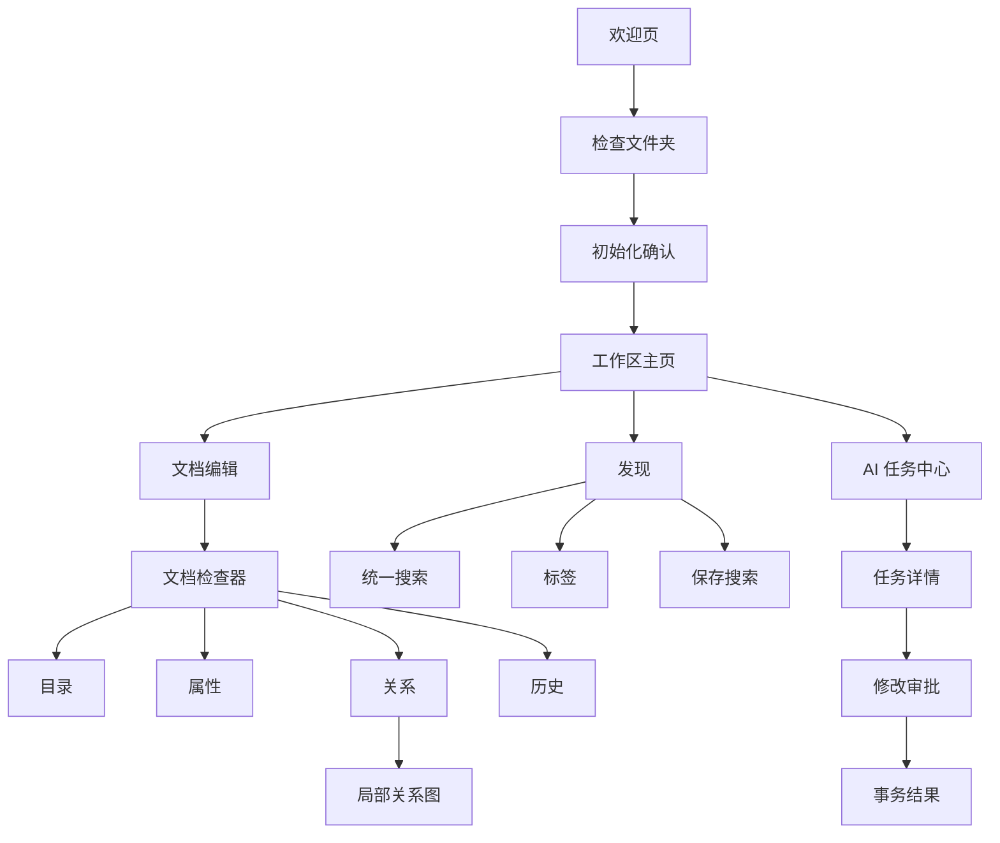

# Nolia 一次性升级 UI/UX 规格

> 文档状态：实现与视觉验收规格
>
> 关联产品方案：`docs/product/PRODUCT_UPGRADE_PLAN.md`
>
> 关联技术设计：`docs/architecture/TECHNICAL_UPGRADE_DESIGN.md`
>
> 目标平台：macOS、Windows、Linux 桌面端
>
> 最小窗口：780 x 520
>
> 最近更新：2026-07-11

## 1. 设计目标

目标版本需要把 Nolia 从“功能完整的 Markdown 工具”升级为“有明确知识工作流的本地工作台”。设计必须同时满足：

- 新用户不阅读手册也能打开已有 Markdown 文件夹并开始写作。
- 熟练用户可以用键盘快速打开、切换、搜索和执行命令。
- 默认编辑界面安静，专业功能按上下文出现。
- 文件、属性、链接、搜索、AI 和历史属于同一知识工作流。
- AI 读取范围、来源、修改和执行状态始终可见。
- 所有高风险操作都有预览、确认、结果和恢复入口。
- 780 px 最小宽度下不存在重叠、裁切或不可达操作。

## 2. 体验原则

### 2.1 内容优先

文档正文是第一视觉层级。导航、工具栏和检查器使用低对比背景，不通过厚重卡片与正文竞争。

### 2.2 渐进披露

默认只展示当前任务所需控制：

- 未选中文本时不展示选区格式浮层。
- 不包含 Mermaid 时不加载或显示 Mermaid 操作。
- 只读工作区不展示可执行写入的主按钮。
- 高级筛选器在用户展开后保持当前会话状态。

### 2.3 一个目标，一个主要入口

- 浏览文件从“文件”进入。
- 找回内容从“发现”进入。
- AI 对话、任务和审批从“AI”进入。
- 当前文档的目录、属性、链接和历史都在检查器中。

### 2.4 状态可见

保存、索引、AI、插件、迁移和冲突不依赖短暂 toast 作为唯一反馈。持续状态必须有持续可见位置。

### 2.5 风险与操作强度匹配

- 低风险操作直接执行并支持撤销。
- 可恢复的批量操作先预览再执行。
- 删除、覆盖、权限和外发数据需要明确确认。
- 确认文案必须说明对象、范围和后果。

### 2.6 桌面效率

设计面向鼠标、触控板和键盘，不按移动端布局思路压缩桌面能力。最小窗口使用抽屉和 overflow menu 保持功能可达。

## 3. 用户心智模型

```text
Workspace 工作区
  Home 工作区主页
  Files 文件
  Discover 发现
  AI 人工智能任务

Document 文档
  Content 正文
  Properties 属性
  Links 关系
  Outline 目录
  History 历史
```

工作区是一个普通文件夹。Nolia 只增加 `.nolia` 派生数据，不接管正文所有权。

## 4. 信息架构

### 4.1 一级导航

| 入口 | 图标 | 内容 | 默认快捷键 |
| --- | --- | --- | --- |
| 文件 | `FolderOpen` | 文件树、快速过滤、新建、移动 | `Cmd/Ctrl+1` |
| 发现 | `Search` | 最近、收藏、标签、保存搜索、统一搜索 | `Cmd/Ctrl+2` |
| AI | `Sparkles` | 对话、任务、待审批、运行历史 | `Cmd/Ctrl+3` |

底部固定：

- 命令面板：`Command`/`Menu` 图标，`Cmd/Ctrl+K`。
- 工作区健康：正常隐藏文字，仅异常显示状态点。
- 设置：`Settings2`。

目录不再放入一级导航。

### 4.2 页面地图



## 5. 应用壳布局

### 5.1 宽屏布局，1280 px 及以上

```text
+-----+------------------+--------------------------------+------------------+
| Nav | Sidebar          | Document / Main Content        | Inspector        |
| 56  | 280, 240-360     | min 560, flexible              | 300, 280-420     |
|     |                  |                                |                  |
+-----+------------------+--------------------------------+------------------+
| Status bar: workspace, save, index, words, task state                      |
+---------------------------------------------------------------------------+
```

尺寸：

- 应用内边距：8 px。
- 面板间分隔：1 px border，不使用 10 px 装饰性空槽。
- Nav：56 px；macOS 顶部为 traffic light 保留 28 px 安全区。
- Sidebar 默认 280 px，可调整 240 至 360 px。
- Inspector 默认 300 px，可调整 280 至 420 px。
- Status bar：28 px。
- Tab bar：36 px。
- Editor top bar：40 px。

### 5.2 中等布局，960 至 1279 px

- Nav：52 px。
- Sidebar：默认 260 px，可折叠。
- Inspector 以右侧 overlay drawer 打开，宽 320 px，不压缩编辑区。
- AI 上下文侧栏与 Inspector 互斥。
- Tab bar 保留；路径缩短为文件名，完整路径放 tooltip。

### 5.3 紧凑布局，780 至 959 px

- Nav：48 px，只显示图标和 tooltip。
- Sidebar 作为左侧 drawer，打开时覆盖主内容并有 backdrop。
- Inspector 作为右侧 drawer。
- 主编辑区占满剩余宽度。
- Editor top bar 将低频动作收进 `MoreHorizontal` 菜单。
- 编辑模式显示图标 segmented control，必要时只显示当前模式和下拉菜单。
- 状态栏只显示保存、字数和异常状态；路径放 tooltip。

### 5.4 焦点模式

- 隐藏 Nav、Sidebar、Inspector、Status bar。
- 保留 36 px 极简 top bar，显示文件名、保存状态和退出按钮。
- 鼠标移动到窗口顶部不自动弹出大量工具。
- `Esc` 不退出焦点模式，避免与弹窗关闭冲突；使用原快捷键或明确按钮。

## 6. 工作区欢迎与初始化

### 6.1 欢迎页

目标：让用户只做一个选择，不展示产品功能宣传。

布局：

```text
+------------------------------------------------------------------+
| Nolia                                                            |
|                                                                  |
| 打开你的 Markdown 文件夹                                         |
| [打开文件夹]  [新建空工作区]                                     |
|                                                                  |
| 最近工作区                                                       |
| Project Alpha       /Users/.../alpha          昨天 14:20   >     |
| Research            路径不可用                  重新定位     ...   |
+------------------------------------------------------------------+
```

要求：

- 品牌名是首要标题，说明文字不超过两行。
- 删除“最近记录/可打开/需定位”统计卡；无数据时统计没有决策价值。
- 最近工作区使用紧凑列表，不使用大面积空卡片。
- 路径不可用提供“重新定位”和“移除记录”，不允许点击后只报错。
- 主按钮“打开文件夹”，次按钮“新建空工作区”。

### 6.2 文件夹检查

选择目录后进入检查状态：

| 状态 | 显示内容 | 主操作 |
| --- | --- | --- |
| 已初始化 | 名称、文件数、索引状态 | 打开工作区 |
| 可初始化 | Markdown 数量、目录权限、将创建 `.nolia` | 初始化并打开 |
| 只读 | 可读文件数、不能保存的原因 | 以只读方式打开 |
| 不可访问 | 权限或路径原因 | 重新选择 |
| `.nolia` 损坏 | 可恢复内容、备份说明 | 修复副本并打开 |

初始化确认不使用模糊的“确定”。按钮必须写“初始化并打开”。

### 6.3 初始化进度

- 创建 `.nolia` 小于 500 ms 时不显示进度页。
- 索引在后台运行，用户可以立即浏览文件。
- Sidebar 顶部显示细进度条和“正在建立搜索索引 32%”。
- 索引失败不阻止写作，发现页显示降级状态和“重新建立索引”。

## 7. 工作区主页

### 7.1 布局

主页是 unframed 内容页，不使用卡片网格作为主要结构。

```text
+--------------------------------------------------------------+
| Project Alpha                                      10:42     |
| [新建笔记] [今日笔记] [快速捕获]                            |
|                                                              |
| 最近编辑                                                     |
| API Design                       10 分钟前       docs/api.md  |
| Meeting Notes                    昨天            notes/...    |
|                                                              |
| 收藏                         待处理                           |
| Architecture                2 个 AI 修改待审批               |
| Release Checklist           搜索索引需要更新                 |
|                                                              |
| 最近 AI 任务                                                  |
| 整理 Inbox           已完成  8 个建议             查看结果   |
+--------------------------------------------------------------+
```

### 7.2 主页模块

- Quick actions：新建笔记、今日笔记、快速捕获。
- Recent edits：最多 8 条，键盘可聚焦。
- Favorites：最多 6 条，超出进入发现页。
- Attention：AI 待审批、冲突、只读、索引或历史 quota 警告。
- Recent AI tasks：最多 5 条。

模块无内容时直接隐藏，不展示多个“暂无内容”框。全部为空时显示一个引导区：新建笔记或导入模板。

## 8. 文件 Sidebar

### 8.1 Header

```text
文件                          [刷新] [新建]
[搜索文件或路径                              ]
```

- 标题 14 px/600。
- 搜索输入高 32 px。
- 刷新只在 watcher degraded 或用户手动需要时突出；正常状态不持续旋转。
- 新建按钮使用 `Plus` 图标，点击打开菜单：笔记、文件夹、从模板。

### 8.2 Tree row

- 行高 28 px。
- 缩进每级 14 px。
- 展开箭头 14 px，文件类型图标 15 px。
- 文件名单行省略，完整路径 tooltip 延迟 500 ms。
- active 使用轻背景和 2 px 左侧 accent，不使用厚边框矩形。
- dirty 文档在名称后显示 6 px 圆点。
- 外部冲突显示 warning icon，不用颜色作为唯一信号。

### 8.3 Tree interaction

- 单击文件打开。
- 单击文件夹展开并选中。
- `Enter` 打开，`ArrowLeft/Right` 折叠展开，`F2` 重命名，`Delete` 打开删除确认。
- 拖拽时显示目标文件夹整行高亮和插入结果文案。
- 键盘用户可以通过“移动到...”对话框完成同一任务。
- 右键菜单顺序：打开、在新标签打开、收藏、复制路径、复制/粘贴、移动、重命名、在文件管理器显示、移到废纸篓。

### 8.4 大文件树

- 使用虚拟列表后必须保留正确 `aria-setsize`、`aria-posinset` 和焦点恢复。
- 搜索过滤时自动展开命中路径，但清空搜索后恢复用户原展开状态。
- 目录加载中使用固定行高 skeleton，不能导致整树跳动。

## 9. 文档标签与会话

### 9.1 Tab bar

每个 tab 包含：

- 文件类型图标。
- 文件名。
- dirty dot 或保存中 spinner。
- hover/focus 时显示关闭图标。

规则：

- 最小宽 120 px，最大宽 220 px。
- tab 过多时横向滚动并提供 tab list menu。
- 中键关闭。
- `Cmd/Ctrl+W` 关闭当前 tab。
- `Cmd/Ctrl+Shift+T` 恢复最近关闭。
- `Cmd/Ctrl+Tab` 按最近使用顺序切换。
- workspace session 默认恢复最近 8 个 tab，最多保存 20 个引用。

### 9.2 关闭策略

- 自动保存成功且无冲突：直接关闭。
- 正在保存：等待完成，超过 2 秒显示进度与取消关闭。
- 冲突或保存失败：打开关闭确认，提供“返回处理”“保留本地副本并关闭”“放弃本地更改”。
- 只读文档有本地修改：必须另存为或放弃。

## 10. 编辑器

### 10.1 Top bar

左侧：

- Sidebar toggle。
- 当前相对路径 breadcrumb；紧凑布局只显示文件名。

右侧：

- 收藏。
- 查找。
- Inspector toggle。
- 编辑模式 segmented control。
- More menu。

不在 top bar 常驻“刷新文件树”。文件刷新属于 Sidebar 或 workspace health。

### 10.2 模式控制

| 模式 | 标签 | 使用场景 |
| --- | --- | --- |
| WYSIWYG | 编辑 | 默认写作 |
| Source | 源码 | 精确 Markdown 编辑 |
| Split | 分屏 | 同时检查源码和输出 |

- 宽屏使用三段 segmented control。
- 中等布局显示“编辑 / 源码 / 分屏”短标签。
- 紧凑布局显示当前模式按钮，点击菜单选择。
- 模式切换失败时保持当前模式，并在编辑器上方显示可操作错误条。

### 10.3 文档正文

- 默认正文最大宽度 760 px。
- Wide 设置 920 px，Full 跟随窗口但保留 40 px 最小边距。
- 正文基础字号 16 px，行高 1.7。
- 段落间距 0.75em。
- H1 30 px，H2 24 px，H3 20 px；不随 viewport 缩放。
- 中文和拉丁字体使用系统 UI/正文栈，代码使用等宽字体。
- Letter spacing 固定为 0。

### 10.4 Markdown 工具

工具分两层：

1. 选区浮层：粗体、斜体、删除线、行内代码、链接、AI。
2. 固定轻量工具栏：撤销/重做、段落类型、列表、任务、引用、代码块、图片、表格、更多。

固定工具栏高 36 px，可横向 overflow，但按钮不能被裁切。紧凑布局将表格、公式、Mermaid 和 TOC 放入更多菜单。

### 10.5 查找替换

- 浮层锚定编辑区右上，不覆盖 top bar。
- 显示当前匹配/总数。
- 支持大小写、全词、正则；无结果时显示“0 个结果”。
- `Enter` 下一个，`Shift+Enter` 上一个，`Esc` 关闭并恢复编辑器焦点。
- Split 模式默认搜索当前焦点 pane，可切换“源码/预览”。

### 10.6 链接补全

输入 `[[` 时打开补全菜单：

- 最近匹配优先。
- 每项显示标题和相对路径。
- 支持继续输入 `#` 选择标题。
- 无匹配时提供“创建新笔记”。
- 菜单完全支持方向键、Enter、Tab 和 Esc。

## 11. 文档检查器

### 11.1 Tab

| Tab | 图标 | 内容 |
| --- | --- | --- |
| 目录 | `List` | 标题层级和当前滚动位置 |
| 属性 | `SlidersHorizontal` | frontmatter 字段和标签 |
| 关系 | `Link2` | 出链、反向链接、未链接提及、局部图 |
| 历史 | `History` | 版本列表、diff、恢复 |

Tab 使用图标加短文字，不在四个独立卡片中展示。

### 11.2 目录

- 当前所在标题高亮。
- 深度缩进每级 12 px，最多显示 6 级。
- 点击后平滑跳转，但遵循 reduced motion。
- 无标题时显示一句“添加标题后，目录会显示在这里”，不显示空框。

### 11.3 属性

```text
属性                                      [+]
状态        [进行中 v]
日期        [2026-07-11]
优先级      [高 v]
标签        [architecture] [ai] [+]
---------------------------------------------
[查看 YAML 源码]
```

- 字段名列宽 88 px。
- boolean 使用 switch，枚举使用 select，日期使用日期输入，列表使用 token input。
- 未知类型显示只读值和“在源码中编辑”。
- 删除字段通过行菜单完成，可撤销。
- YAML 错误时禁用可视编辑，展示错误行和“打开源码修复”。

### 11.4 关系

分区顺序：

1. 出链。
2. 反向链接。
3. 未链接提及。
4. “打开局部关系图”命令。

每项显示来源标题、相对路径和一行上下文。未链接提及提供“转为链接”按钮，并展示修改预览。

### 11.5 历史

- 列表按时间倒序，显示来源：自动保存、手动版本、冲突前、恢复前、AI 写入前。
- 点击版本进入双栏或 inline diff。
- 新增绿色、删除红色，同时使用 `+/-` 标记。
- “恢复此版本”需要确认，并说明当前版本会先创建快照。
- quota 警告链接到工作区健康页。

## 12. 发现页与统一搜索

### 12.1 发现页布局

```text
+-----------------------+----------------------------------------+
| 最近                  | [搜索全部内容                         ] |
| 收藏                  |                                        |
| 标签                  | 最近编辑                               |
| 保存搜索              | ...                                    |
|                       |                                        |
|                       | 收藏                                   |
|                       | ...                                    |
+-----------------------+----------------------------------------+
```

发现页内部二级导航宽 200 px；在 960 px 以下变为顶部分段/下拉筛选。

### 12.2 搜索输入

- 高 40 px，始终位于发现内容顶部。
- Placeholder：“搜索标题、正文、路径、标签或属性”。
- `Cmd/Ctrl+P` 直接聚焦快速打开文件。
- `Cmd/Ctrl+Shift+F` 打开发现页全文搜索。
- 输入 150 ms debounce；Enter 立即搜索。

### 12.3 筛选器

紧邻搜索框显示已启用 filter chip：

- 范围：标题、正文、路径、标签、属性、任务。
- 路径前缀。
- 标签。
- 修改时间。
- 精确/混合模式。

Chip 有明确关闭图标和 tooltip。更多筛选通过 popover，不使用永久复杂表单。

### 12.4 结果

每行固定最小高 72 px：

- 标题和命中类型。
- 相对路径。
- 最多两行摘要，命中词使用 `mark`。
- 修改时间和匹配来源。
- 语义结果显示“语义相关”，不伪装成精确命中。

键盘上下选择，Enter 当前 tab 打开，`Cmd/Ctrl+Enter` 新 tab 打开。右侧可选 preview pane 只在 1180 px 以上出现。

### 12.5 保存搜索

- 保存时要求名称，并显示当前 query/filter 摘要。
- 保存项出现在发现二级导航。
- 修改搜索后显示“已修改”，用户可以更新或另存。

## 13. 局部关系图

关系图是全屏主内容视图，不放在小卡片中。

```text
+--------------------------------------------------------------+
| < 返回文档    API Design 的关系       深度 [1 v] [筛选]      |
|                                                              |
|                        [Current]                             |
|                   /        |        \                        |
|              [Inbound] [Outbound] [Mention]                 |
|                                                              |
| [选中节点详情]                                               |
+--------------------------------------------------------------+
```

- 当前节点使用 accent 实心描边。
- 直接链接使用中性 surface，未链接提及使用虚线。
- 不用不同颜色作为边类型唯一编码，配合线型和图例。
- 滚轮缩放、拖拽平移、双击重置。
- 键盘用户通过可同步的节点列表选择和打开。
- 节点超过限制时显示“仅展示最相关的 60 个节点”。

## 14. AI 工作台

### 14.1 一级 AI 页面

```text
+----------------------+-----------------------------------------+
| 新对话               | AI 任务                                 |
| 待审批 2             |                                         |
| 运行中 1             | 整理 Inbox          等待审批            |
| 已完成               | 生成项目周报        正在读取 4/12       |
| 失败                 | 检查孤立笔记        已完成               |
|                      |                                         |
+----------------------+-----------------------------------------+
```

AI 页面默认展示任务列表，而不是空聊天欢迎语。待审批排在最前。

### 14.2 对话 composer

- 输入框最小 3 行，最大 8 行。
- 上方显示 Context chips：当前文档、选区、工作区搜索、整个工作区。
- 每个 chip 可移除；新增上下文必须由用户显式选择或设置允许。
- Provider/模型显示在 composer footer，可切换。
- 发送按钮使用 `Send` 图标；运行时变为 `Square` 停止图标。
- `Enter` 发送、`Shift+Enter` 换行；支持设置反转。

### 14.3 内联 AI

选中文本后，浮层提供：

- 润色。
- 精简。
- 扩写。
- 翻译。
- 提取任务。
- 自定义请求。

结果以 inline diff 显示在正文附近：接受、替换、插入到下方、复制、重试、关闭。关闭不修改正文。

### 14.4 任务详情

任务详情包括：

- 用户请求。
- Context 与数据外发范围。
- Provider 和模型。
- 工具步骤时间线。
- 来源。
- proposal 或最终回答。
- 运行日志摘要和错误恢复。

工具步骤默认折叠，只展示“搜索了 8 篇笔记”“读取了 3 个文件”等用户语言，不直接暴露内部 JSON。

### 14.5 Diff 审批

审批是独立主内容视图，不能挤在窄侧栏：

```text
+--------------------------------------------------------------+
| < 返回任务   3 个文件，8 项修改                [拒绝] [应用] |
| [x] docs/api.md        修改 3 处                            |
|     - old line                                             |
|     + new line                                             |
| [x] notes/index.md      新增链接                              |
| [ ] Archive/old.md      移动文件，依赖上方目录创建             |
|                                                              |
| 将应用 2 个文件中的 5 项修改                                 |
+--------------------------------------------------------------+
```

要求：

- 文件和 operation 都可选择。
- 依赖 operation 自动联动并解释原因。
- 新增、删除、移动、重命名使用不同图标和文字。
- 默认不选中删除操作；本次 AI 范围原则上仍不提供删除工具。
- 主按钮显示准确数量：“应用 5 项修改”。
- 应用期间显示逐项状态，不能关闭后丢失任务。
- 成功后提供“打开修改文件”和“撤销事务”。
- 部分失败展示成功、失败、已回滚和需人工处理四类结果。

## 15. 快速捕获、Daily Note 与模板

### 15.1 快速捕获

全局快捷键打开紧凑 dialog：

```text
快速捕获
[标题，可选                                      ]
[正文...                                         ]
保存到  Inbox/2026-07.md                     [v]
                                  [取消] [捕获]
```

- 打开后焦点在正文。
- `Cmd/Ctrl+Enter` 提交。
- 路径不可写时保留草稿并提供另选位置。

### 15.2 Daily Note

- 当日文件存在时直接打开。
- 不存在时显示模板名称和目标路径，创建后打开。
- 创建失败保留用户触发上下文，不出现空 tab。

### 15.3 模板选择器

- 列表显示模板名、描述和相对路径。
- 右侧预览 frontmatter 和正文前 30 行。
- 支持键盘搜索和选择。
- 没有模板时提供“创建第一个模板”，不链接营销内容。

## 16. 命令面板

### 16.1 布局

- 宽 640 px，最大高度为 viewport 的 70%。
- 输入高 44 px。
- 结果行高 44 px。
- 默认显示最近命令和快速打开文件。

### 16.2 交互

- `ArrowUp/Down` 移动选择。
- `Enter` 执行。
- `Cmd/Ctrl+Enter` 在新 tab 打开文件类结果。
- `Esc` 关闭并恢复原焦点。
- 匹配命令标题、分类、关键词和快捷键。
- 当前不可用命令隐藏；需要说明的命令 disabled 并展示原因。

### 16.3 结果结构

```text
[icon] 命令标题                         Cmd+Shift+P
       分类 / 一行说明
```

不能只让 Enter 永远执行第一项而没有可见选中状态。

## 17. 设置

### 17.1 分类

建议分类：

- 外观。
- 编辑器。
- 文件与附件。
- 搜索与索引。
- AI。
- 插件。
- 高级与诊断。

### 17.2 布局

- Dialog 宽 880 px，高度 min(720 px, viewport - 48 px)。
- 左侧分类 200 px，右侧内容滚动。
- 紧凑窗口使用全屏 modal，分类为顶部 select。
- 右侧按 section 分组，section 不使用外层卡片。
- 保存即生效；需要重启的设置在字段旁显示“重启后生效”。

### 17.3 控件规则

- 二元设置使用 switch/checkbox。
- 少量互斥模式使用 segmented control。
- 多项选择使用 select/menu。
- 数值使用 input 或 stepper，并展示单位和范围。
- 颜色使用 swatch，不只显示十六进制文本。
- 危险操作集中在高级页底部，使用 red text/button。

## 18. 插件体验

### 18.1 插件列表

每项显示：

- 名称、版本、API 版本和来源目录。
- 状态：已启用、已停用、需迁移、权限变化、运行失败。
- 权限摘要。
- 启用 switch 和详情按钮。

不把内置扩展与外部插件混成同一长列表；使用独立 section。

### 18.2 权限确认

权限 dialog 按能力分组：

```text
启用 JSON Tools？

文件
  读取工作区中的 JSON 文件
  修改你明确打开的 JSON 文件

网络
  不允许网络访问

插件在隔离环境中运行。权限变化后会再次询问。

[取消] [允许并启用]
```

- 不展示内部 permission ID 作为唯一解释。
- host-specific 网络权限展示完整 host。
- 权限变化显示新增、移除和未变化。
- API v2 插件显示“与当前安全运行时不兼容”，不能启用。

### 18.3 隔离 frame

- 插件 UI 有明确容器边界和标题。
- 加载超过 400 ms 显示固定尺寸 loading。
- 超时提供重试和禁用。
- 崩溃不替换整个应用页面。

## 19. 工作区健康与错误恢复

### 19.1 健康入口

正常时状态栏显示“工作区已就绪”或隐藏文字。存在问题时显示带数量的 warning：

```text
[!] 工作区有 2 个问题
```

点击打开健康页：

- 目录权限。
- watcher。
- 全文索引。
- 语义索引。
- 历史空间。
- 数据库和迁移。
- 同步冲突提示。

### 19.2 错误展示级别

| 类型 | UI |
| --- | --- |
| 已成功的短操作 | toast，3 秒，可关闭 |
| 可自动重试的后台问题 | inline banner/status item |
| 需要用户决策 | dialog 或持久 panel |
| 多项执行结果 | result page |
| 应用级不可恢复 | full-page error boundary |

### 19.3 文件冲突

冲突 dialog 必须显示：

- 文件路径。
- 本地修改时间、磁盘修改时间。
- 变更摘要。
- 比较版本。
- 重新加载磁盘、保留本地副本、覆盖磁盘三个明确动作。

覆盖磁盘不是默认聚焦按钮。

## 20. 视觉系统

### 20.1 色彩

Light：

```css
--bg: #f4f6f8;
--surface: #ffffff;
--panel: #f8fafc;
--panel-strong: #edf1f5;
--text: #172033;
--muted: #5e6b7d;
--subtle: #7d8998;
--border: #d7dee8;
--accent: #2563eb;
--accent-hover: #1d4ed8;
--accent-soft: #e8f0ff;
--success: #16805b;
--warning: #a15c00;
--danger: #c73737;
--ai: #6d4aff;
```

Dark：

```css
--bg: #0e1116;
--surface: #151a21;
--panel: #1b222c;
--panel-strong: #242d39;
--text: #e7ecf2;
--muted: #aab4c1;
--subtle: #7f8a99;
--border: #303946;
--accent: #6ba3ff;
--accent-hover: #8bb7ff;
--accent-soft: #172b49;
--success: #52bd8b;
--warning: #e0a54a;
--danger: #ff8585;
--ai: #a48cff;
```

AI 紫色只用于 AI 身份、上下文和任务状态，不作为全局主色或大面积背景。

### 20.2 Typography

```css
--font-ui: Inter, -apple-system, BlinkMacSystemFont, "SF Pro Text", "Segoe UI", sans-serif;
--font-body: -apple-system, BlinkMacSystemFont, "SF Pro Text", "Segoe UI", sans-serif;
--font-mono: "SFMono-Regular", "Cascadia Mono", "JetBrains Mono", Consolas, monospace;
```

| Token | Size/Line | Weight | 用途 |
| --- | --- | --- | --- |
| display | 30/38 | 700 | 工作区名、文档 H1 |
| title | 20/28 | 650 | 页面标题 |
| section | 15/22 | 650 | section heading |
| body | 14/21 | 400 | UI 正文 |
| body-strong | 14/21 | 600 | 行标题 |
| caption | 12/18 | 400 | 路径、时间、帮助 |
| editor-body | 16/27 | 400 | Markdown 正文 |

所有 token `letter-spacing: 0`。

### 20.3 Spacing

采用 4 px 基础单位：4、8、12、16、20、24、32、40。

- Icon button：28 或 32 px。
- 普通 button：32 px。
- 主 dialog button：36 px。
- Input：32 px，搜索主输入 40 px。
- 面板内容 padding：12 或 16 px。
- 页面内容最大 padding：32 px。

### 20.4 Radius 与阴影

- 小控件：4 px。
- 输入、按钮、列表 selection：6 px。
- dialog、popover、独立重复项：8 px。
- 禁止大于 12 px 的常规卡片圆角。
- 页面 section 不使用浮动卡片。
- 阴影只用于 dialog、popover、drawer 和浮层，不用于固定 panel。

### 20.5 图标

- 使用 `lucide-react`。
- 标准 16 px，导航 18 px，空状态最大 24 px。
- 熟悉操作优先图标：关闭、搜索、设置、撤销、重做、收藏。
- 不熟悉图标必须有 tooltip 和 `aria-label`。
- 不手绘与 Lucide 重复的 SVG。

## 21. 组件状态规范

所有交互组件至少覆盖：

- default。
- hover。
- active/pressed。
- focus-visible。
- disabled。
- loading。
- error，若适用。

### 21.1 Focus

```css
outline: 2px solid color-mix(in srgb, var(--accent) 65%, transparent);
outline-offset: 2px;
```

不能通过移除 outline 后只依赖背景变化表示焦点。

### 21.2 Loading

- 小于 300 ms 的操作不显示 spinner。
- 300 ms 以上显示局部进度。
- 2 秒以上显示文字说明和可取消入口，若操作可取消。
- Skeleton 必须使用稳定尺寸，避免 layout shift。

### 21.3 Empty state

空状态由一句状态说明和最多一个主要操作组成。禁止在应用内部使用长篇功能说明或快捷键教学文本。

## 22. Motion

- Hover/press：80 至 120 ms。
- Drawer/dialog：160 至 200 ms。
- 面板折叠：160 ms。
- 不使用弹跳、视差、bokeh 或装饰性大幅动画。
- `prefers-reduced-motion: reduce` 时取消位移和 smooth scroll，只保留即时状态变化。
- Mermaid 和关系图动画默认关闭，除非图本身需要表达状态。

## 23. Keyboard

| 快捷键 | 行为 |
| --- | --- |
| `Cmd/Ctrl+N` | 新建笔记 |
| `Cmd/Ctrl+Shift+N` | 从模板新建 |
| `Cmd/Ctrl+O` | 打开文件夹 |
| `Cmd/Ctrl+K` | 命令面板 |
| `Cmd/Ctrl+P` | 快速打开文件 |
| `Cmd/Ctrl+Shift+F` | 统一搜索 |
| `Cmd/Ctrl+S` | 保存当前文档 |
| `Cmd/Ctrl+W` | 关闭当前 tab |
| `Cmd/Ctrl+Shift+T` | 恢复关闭 tab |
| `Cmd/Ctrl+1/2/3` | 文件/发现/AI |
| `Cmd/Ctrl+,` | 设置 |
| `Cmd/Ctrl+Alt+I` | 切换 Inspector |
| `Cmd/Ctrl+Shift+I` | 焦点模式，macOS 可按菜单适配 |

快捷键冲突以平台系统约定为先。菜单、命令面板和 tooltip 使用同一 shortcut registry，禁止三处分别硬编码。

## 24. Accessibility

### 24.1 目标

- 关键流程达到 WCAG 2.2 AA。
- 所有操作可仅用键盘完成。
- 文本和图标对比度满足 AA。
- 颜色不是状态唯一表达。
- 动态状态通过适当 live region 通知，但不重复朗读流式 AI 每个 token。

### 24.2 Landmark

- Nav：`nav`，label“工作区导航”。
- Sidebar：`aside`，label 随入口变化。
- Main：`main`，唯一主内容。
- Inspector：`aside`，label“文档检查器”。
- Status bar：`role=status`，只播报重要变化。

### 24.3 Tree

- 使用 `role=tree/treeitem/group` 或语义等价实现。
- 提供 expanded、selected、level、setsize 和 posinset。
- 虚拟化不能导致屏幕阅读器无法知道列表规模。

### 24.4 Dialog

- 打开时焦点进入标题后的首个主要控件。
- Tab 焦点限制在 dialog。
- 关闭后恢复触发控件。
- 危险确认默认焦点放在取消或安全操作。

### 24.5 AI

- 流式输出按段落批量播报，间隔不低于 1 秒。
- 工具步骤、来源和 diff 有语义标题。
- diff 行提供“新增/删除/上下文”文本，不只使用背景色。

## 25. 文案规范

### 25.1 语气

- 简短、具体、说明下一步。
- 不使用“糟糕”“魔法”“智能地”等情绪化或模糊描述。
- 不把错误归因于用户。
- 命令使用动词开头。

### 25.2 示例

| 不推荐 | 推荐 |
| --- | --- |
| 操作失败 | 无法保存 `docs/api.md` |
| 确定吗？ | 将 3 个文件移到废纸篓？ |
| AI 正在思考 | 正在搜索工作区 |
| 权限不足 | 此工作区为只读，选择其他位置保存 |
| 确定 | 初始化并打开 |
| 应用 | 应用 5 项修改 |

### 25.3 路径

- 工作区内默认显示相对路径。
- 绝对路径只在欢迎页、工作区设置、文件管理器相关操作和诊断中显示。
- 路径允许选择复制，不能因省略而无法获取完整值。

## 26. 全状态矩阵

每个主要页面必须实现以下适用状态：

| 页面 | Loading | Empty | Error | Read-only | Degraded | Success/Result |
| --- | --- | --- | --- | --- | --- | --- |
| 欢迎/初始化 | 检查目录 | 无最近 | 不可访问 | 只读打开 | 配置损坏 | 已打开 |
| 工作区主页 | 加载摘要 | 新工作区 | 摘要失败 | 隐藏写操作 | 索引警告 | 快速操作反馈 |
| 文件树 | 目录加载 | 空目录 | watcher 失败 | 禁用写菜单 | snapshot 重载 | patch 更新 |
| 编辑器 | 文件读取 | 空文档 | 解析/保存失败 | 只读 banner | 预览降级 | 已保存 |
| 属性 | 解析中 | 无属性 | YAML 错误 | 控件只读 | 未知类型 | 已更新 |
| 搜索 | 查询中 | 无结果 | 索引错误 | 可搜索 | 语义降级 | 结果列表 |
| AI | 运行中 | 无任务 | Provider/工具失败 | proposal 不可应用 | 部分来源不可用 | task result |
| 插件 | frame 加载 | 无外部插件 | 崩溃/超时 | 权限拒绝 | API 不兼容 | 已启用 |
| 历史 | 读取中 | 无版本 | snapshot 缺失 | 可查看 | quota 警告 | 已恢复 |

## 27. 响应式验收矩阵

必须在以下 viewport 截图和交互验证：

| Viewport | 必测页面 |
| --- | --- |
| 1440 x 900 | Home、Editor+Inspector、Discover preview、AI diff、Settings |
| 1320 x 860 | 所有核心页面基准 |
| 1100 x 760 | Editor、Discover、AI task、Settings |
| 900 x 700 | Sidebar、Inspector drawer、toolbar overflow、dialog |
| 780 x 520 | 最小窗口全部主要操作可达 |

每个 viewport 检查：

- body 无横向滚动。
- Nav、Sidebar、Main、Inspector、Status 不重叠。
- 按钮文字、路径和 tab 不溢出容器。
- popover 和 menu 不越出 viewport。
- dialog 标题、正文和 footer 均可见或可滚动。
- drawer 关闭后焦点恢复。

## 28. 视觉回归清单

建议新增以下截图基线：

```text
welcome-empty-light.png
welcome-recent-dark.png
folder-initialize.png
workspace-home-light.png
workspace-home-index-warning.png
editor-wysiwyg-inspector.png
editor-source-compact.png
editor-conflict-dialog.png
properties-valid.png
properties-yaml-error.png
discover-hybrid-results.png
discover-empty.png
local-graph.png
ai-task-running.png
ai-approval-multifile.png
ai-transaction-partial-failure.png
plugin-permission.png
plugin-incompatible.png
workspace-health.png
settings-dark.png
```

视觉测试不能只检查截图，还要检查元素边界、对比度、overflow、focus 和 modal stacking。

## 29. 前端组件映射

建议组件：

```text
AppShell
PrimaryNav
WorkspaceSidebar
WorkspaceHome
DocumentTabBar
DocumentTopBar
MarkdownEditorHost
DocumentInspector
OutlinePanel
PropertiesPanel
LinksPanel
HistoryPanel
DiscoverPage
UnifiedSearchInput
SearchResultList
LocalGraphView
AiTaskCenter
AiTaskDetail
AiApprovalView
WorkspaceHealthPage
CommandPalette
SettingsDialog
PluginFrameHost
```

组件职责：

- 页面组件只组合 feature 组件，不实现文件操作。
- 通用 component 不读取 feature store。
- 异步边界由页面或 feature container 负责。
- 所有 icon button 通过统一 `IconButton` 获得尺寸、tooltip、focus 和 aria 行为。
- Dialog、Drawer、Menu、Popover 使用统一 stacking 和 focus primitive。

## 30. 设计 token 实现

拆分 CSS：

```text
styles/
  tokens.css
  reset.css
  shell.css
  navigation.css
  editor.css
  inspector.css
  discovery.css
  ai.css
  settings.css
  dialogs.css
  accessibility.css
```

禁止规则：

- feature CSS 不定义新的全局颜色常量。
- 不使用 viewport width 计算字体大小。
- 不通过负 letter-spacing 压缩文本。
- 不使用无限制的 `transition: all`。
- z-index 使用 token：base、sticky、popover、drawer、modal、toast。
- 固定格式组件必须定义 min/max、grid track 或 aspect ratio，避免动态内容引发布局跳动。

## 31. 一次性交付设计门禁

UI/UX 只有同时满足以下条件才可随目标版本发布：

- 本文所有“必须”页面和流程已实现，不存在静态占位入口。
- 文件、发现、AI 三个主入口与工作区主页形成完整导航。
- 编辑器、属性、关系、历史和冲突组成完整文档检查流程。
- AI 内联、任务、审批、结果和撤销形成完整闭环。
- 插件权限、隔离错误和 API 不兼容状态可理解、可恢复。
- 第 26 节全状态矩阵不存在缺失状态。
- 第 27 节所有 viewport 通过布局和交互验证。
- 键盘、屏幕阅读器、对比度和 reduced motion 通过验收。
- 中英文及现有支持语言不存在主要按钮或标题溢出。
- 视觉回归、E2E 和技术文档中的性能预算全部通过。

## 32. 设计非目标

本次不设计：

- 营销型 landing page。
- 移动端和触屏优先布局。
- 实时协作头像、评论和 presence。
- Notion 式数据库、看板和表单。
- 全局无限节点知识图谱。
- Canvas、白板或自由空间布局。
- 插件市场浏览和支付流程。
- 大面积渐变、装饰性光斑、3D 或插画主题界面。

这些非目标不能以“先留入口”的方式出现在目标版 UI 中。
