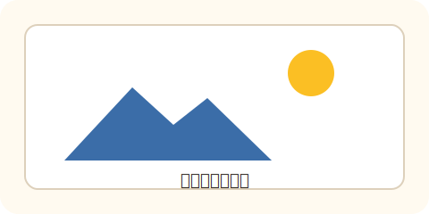
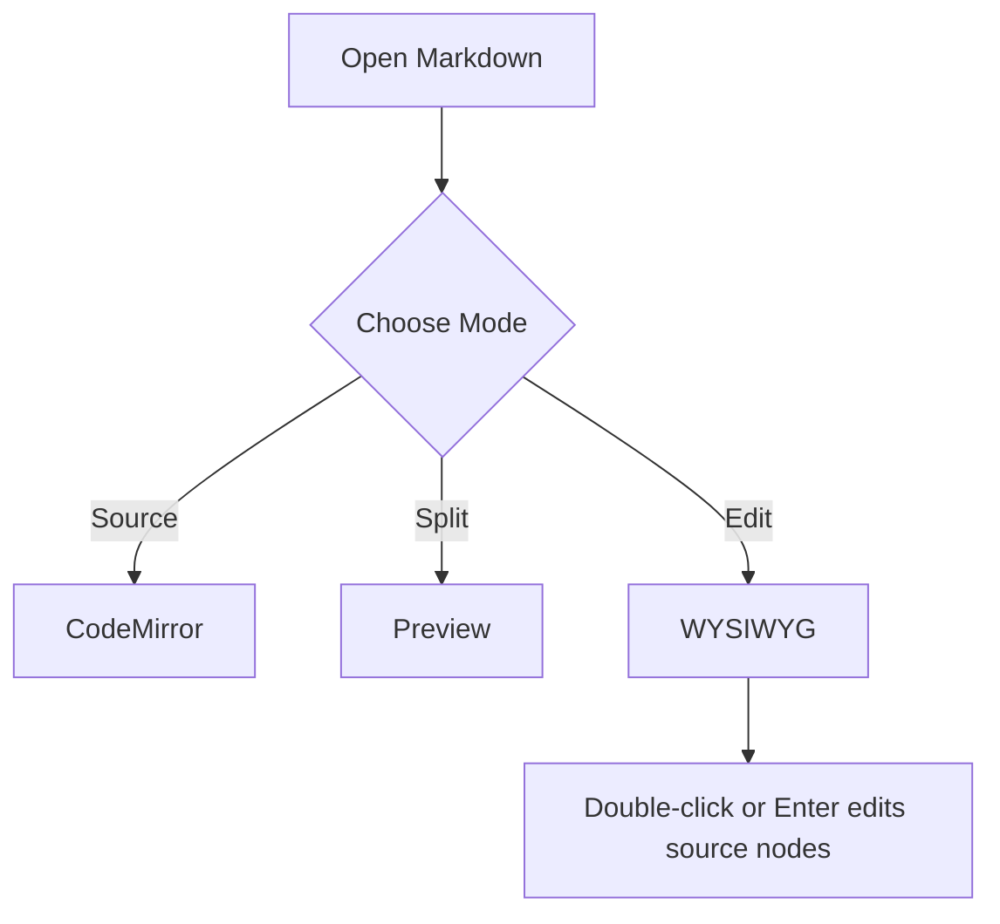
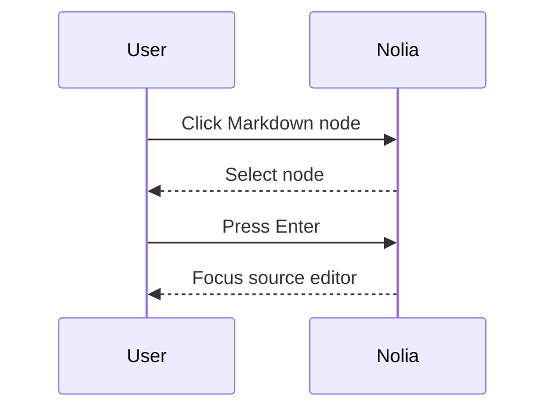

# Nolia Markdown Syntax Test

这份文件用于测试 Nolia 的源码模式、分屏预览和所见即所得编辑模式。建议重点验证：目录跳转、单击选中自定义语法节点、按 Enter 或双击进入源码编辑、Escape 退出编辑、保存后源码不丢失。

[TOC]

## 1. Headings

# H1 一级标题

## H2 二级标题

### H3 三级标题
#### H4 四级标题
##### H5 五级标题

###### H6 六级标题

## 2. Paragraphs And Inline Marks

普通段落包含中文、English、数字 123、标点，以及换行测试。  
这一行前面有两个空格换行，应该显示为同一段落内的软换行。

Inline marks: *italic*, **bold**, ***bold italic***, ~~strikethrough~~, ==highlight==, `inline code`, <kbd>Cmd</kbd> + <kbd>K</kbd>, H<sub>2</sub>O, E = mc<sup>2</sup>, <abbr title="HyperText Markup Language">HTML</abbr>.

Escaped characters: \*not italic\*, \[not a link\], \`not code\`, backslash \\.

Autolinks: https://example.com/path?query=1, <https://nolia.example/docs>, <hello@example.com>.

## 3. Blockquotes And Callouts

> 普通引用第一层。
>
> > 嵌套引用第二层。
>
> 引用内也可以包含 **加粗** 和 [链接](https://example.com)。

> [!NOTE] 可编辑的 NOTE Callout
> 这是一个 callout，WYSIWYG 模式下应作为特殊块展示；单击选中，Enter 或双击编辑源码。

> [!WARNING]+ 展开的 WARNING Callout
> 检查折叠标记、标题和正文是否能 round-trip。

## 4. Lists

- 无序列表 A
- 无序列表 B
  - 嵌套无序列表 B.1
  - 嵌套无序列表 B.2
- 无序列表 C，包含 `inline code`

1. 有序列表一
2. 有序列表二
   1. 嵌套有序列表二点一
   2. 嵌套有序列表二点二
3. 有序列表三

- [x] 已完成任务
- [ ] 未完成任务
- [ ] 包含 **格式化文本** 的任务

## 5. Links, Wiki Links, And Footnotes

普通链接：[Nolia 文档](https://example.com/nolia "link title")。

引用式链接：[引用式链接][ref-link]。

[ref-link]: https://example.com/reference "Reference link title"

双链测试：[[Nolia Home]]、[[Nolia Home#编辑器|带标题和别名的双链]]。

脚注引用测试：这里有一个脚注[^basic]，这里有第二个脚注[^long-note]。

[^basic]: 这是基础脚注定义。
[^long-note]: 这是较长的脚注定义，包含 **加粗**、`inline code` 和一个链接 https://example.com/footnote。

## 6. Images And Attachments

本地图片：


中文路径图片：



附件链接：[下载示例资源](assets/nolia-markdown-test.svg)。

## 7. Tables

| Syntax | Expected | Notes |
| :--- | :---: | ---: |
| **bold** | 居中 | 右侧对齐 |
| `code` | yes | 42 |
| escaped pipe | a \| b | 100% |
| link | [example](https://example.com) | done |

## 8. Definition Lists

Term Alpha
: Definition for alpha.
: Second definition for alpha.

Term Beta
: Definition with **bold**, `code`, and ==mark==.

## 9. Code Blocks

```js
const message = "Hello Nolia";
function greet(name) {
  return `${message}, ${name}!`;
}
console.log(greet("Markdown"));
```

```json
{
  "name": "nolia",
  "enabled": true,
  "count": 3
}
```

```yaml
editor:
  mode: wysiwyg
  outline: true
```

```xml
<note priority="high">
  <title>Nolia</title>
  <done>true</done>
</note>
```

```diff
- old markdown interaction
+ selected node, then Enter to edit source
```

## 10. Math

Inline math: $x^2 + y^2 = z^2$, $\alpha + \beta = \gamma$.

Block math:

$$
\int_0^1 x^2\,dx = \frac{1}{3}
$$

$$
E = mc^2
$$

## 11. Mermaid





## 12. Raw HTML

<details open>
  <summary>HTML details summary</summary>
  <p>这里包含 <mark>mark</mark>、<kbd>Esc</kbd>、<ruby>汉<rt>han</rt></ruby> 和 <code>inline code</code>。</p>
</details>

<div>
  <p><strong>Raw HTML block</strong> should render safely after sanitization.</p>
</div>

## 13. Horizontal Rules

---

***

___

## 14. Edge Cases

Long line: 这是一段很长很长的文本，用于检查编辑器宽度、换行、复制粘贴和保存后的表现是否稳定。This is a long line for wrapping checks in source, split preview, and WYSIWYG editing mode.

Mixed paragraph with image reference text, math $a/b$, wiki [[Edge Case|Alias]], footnote[^edge], and escaped table pipe a \| b.

[^edge]: Edge case footnote definition.

## 15. Manual Checklist

- [ ] 源码模式能完整显示 frontmatter 和所有语法。
- [ ] 分屏预览中标题、表格、图片、Mermaid、公式、脚注可见。
- [ ] 所见即所得模式中单击特殊节点只选中，不直接进入源码编辑。
- [ ] 选中特殊节点后按 Enter 能编辑源码。
- [ ] 双击特殊节点能编辑源码。
- [ ] Escape 或提交后能回到预览状态。
- [ ] 保存后切回源码，Markdown 结构没有被破坏。
